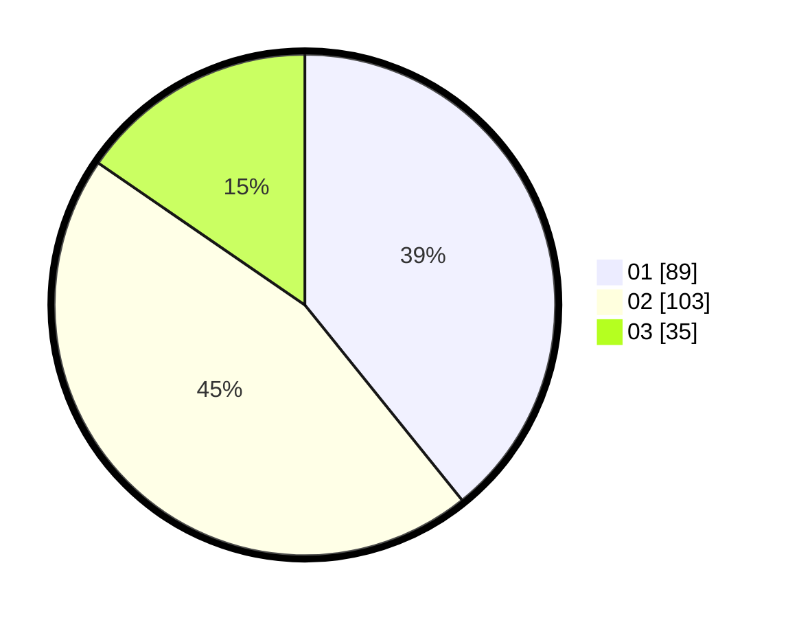

# Hasil

Hasil perolehan suara paslon dapat dilihat pada file paslon-01.txt, paslon-02.txt, dan paslon-03.txt.

Jika tidak ada, artinya data tersebut belum ada pada SIREKAP.

## Perolehan Suara

 * Paslon 01: **89**.
 * Paslon 02: **103**.
 * Paslon 03: **35**.

## Foto C Plano

https://sirekap-obj-formc.kpu.go.id/3797/pemilu/ppwp/31/75/10/10/02/3175101002061-20240214-211234--4205a539-42a5-47fb-a8dc-ccea7cb90365.jpg

https://sirekap-obj-formc.kpu.go.id/3797/pemilu/ppwp/31/75/10/10/02/3175101002061-20240214-211248--be5610c5-43b5-4a80-a124-f14b199c37cb.jpg

https://sirekap-obj-formc.kpu.go.id/3797/pemilu/ppwp/31/75/10/10/02/3175101002061-20240214-211257--c112cce4-1aa2-4919-be75-138f03093fa0.jpg
