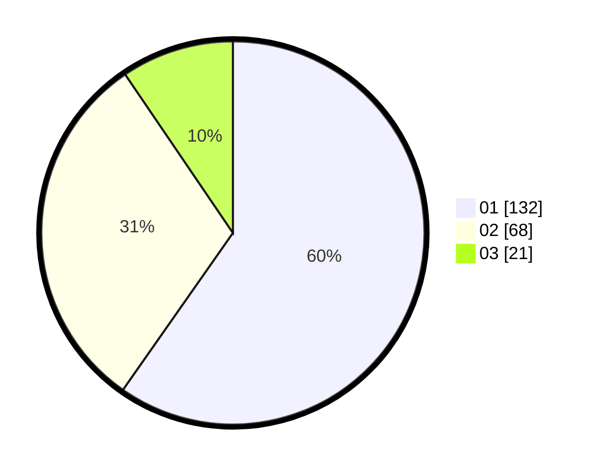

# Hasil

Hasil perolehan suara paslon dapat dilihat pada file paslon-01.txt, paslon-02.txt, dan paslon-03.txt.

Jika tidak ada, artinya data tersebut belum ada pada SIREKAP.

## Perolehan Suara

 * Paslon 01: **132**.
 * Paslon 02: **68**.
 * Paslon 03: **21**.

## Foto C Plano

https://sirekap-obj-formc.kpu.go.id/8247/pemilu/ppwp/31/75/10/10/02/3175101002071-20240214-210947--dad0e569-3ba3-476b-8a8a-ece9d8a02580.jpg

https://sirekap-obj-formc.kpu.go.id/8247/pemilu/ppwp/31/75/10/10/02/3175101002071-20240214-211037--ebbcef30-fd23-4a79-b436-03939571060a.jpg

https://sirekap-obj-formc.kpu.go.id/8247/pemilu/ppwp/31/75/10/10/02/3175101002071-20240214-211128--7a82846a-b01d-4311-996f-d66b8eac7f7b.jpg

## DATA PEMILIH TETAP

Jumlah pemilih dalam DPT: **220**.
 * L: **115**.
 * P: **105**.

## DATA PENGGUNA HAK PILIH

Jumlah pengguna hak pilih dalam DPT: **220**.
 * L: **115**.
 * P: **105**.

Jumlah pengguna hak pilih dalam DPTb: **1**.
 * L: **0**.
 * P: **1**.

Jumlah pengguna hak pilih dalam DPK: **2**.
 * L: **1**.
 * P: **1**.

Jumlah pengguna hak pilih: **223**.
 * L: **116**.
 * P: **107**.

## JUMLAH SUARA SAH DAN TIDAK SAH

JUMLAH SELURUH SUARA SAH: **221**.

JUMLAH SUARA TIDAK SAH: **2**.

JUMLAH SELURUH SUARA SAH DAN SUARA TIDAK SAH: **223**.
