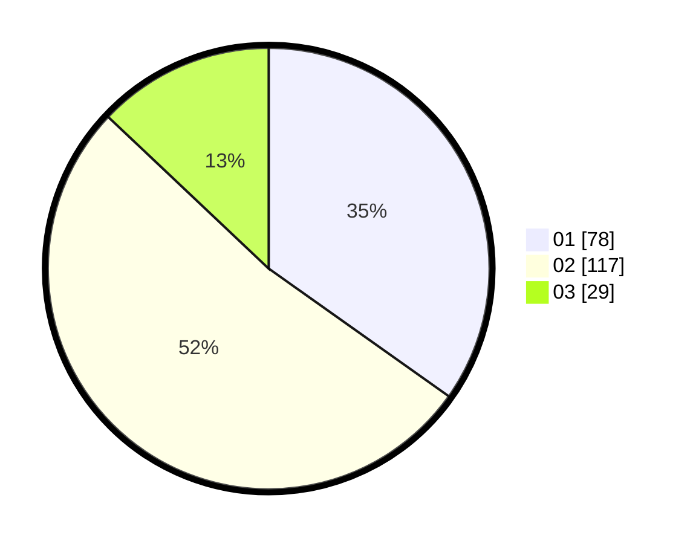

# Hasil

Hasil perolehan suara paslon dapat dilihat pada file paslon-01.txt, paslon-02.txt, dan paslon-03.txt.

Jika tidak ada, artinya data tersebut belum ada pada SIREKAP.

## Perolehan Suara

 * Paslon 01: **78**.
 * Paslon 02: **117**.
 * Paslon 03: **29**.

## Foto C Plano

https://sirekap-obj-formc.kpu.go.id/a309/pemilu/ppwp/31/75/10/10/02/3175101002075-20240214-155145--0de0144e-7316-4862-85b9-9397f49a6fc4.jpg

https://sirekap-obj-formc.kpu.go.id/a309/pemilu/ppwp/31/75/10/10/02/3175101002075-20240214-155148--d688b233-7abe-471e-8831-32b66055d53f.jpg

https://sirekap-obj-formc.kpu.go.id/a309/pemilu/ppwp/31/75/10/10/02/3175101002075-20240214-155150--3a10d92d-126a-47e7-a92b-c047ab6155db.jpg

## DATA PEMILIH TETAP

Jumlah pemilih dalam DPT: **263**.
 * L: **140**.
 * P: **123**.

## DATA PENGGUNA HAK PILIH

Jumlah pengguna hak pilih dalam DPT: **219**.
 * L: **115**.
 * P: **104**.

Jumlah pengguna hak pilih dalam DPTb: **1**.
 * L: **0**.
 * P: **1**.

Jumlah pengguna hak pilih dalam DPK: **4**.
 * L: **1**.
 * P: **3**.

Jumlah pengguna hak pilih: **224**.
 * L: **116**.
 * P: **108**.

## JUMLAH SUARA SAH DAN TIDAK SAH

JUMLAH SELURUH SUARA SAH: **224**.

JUMLAH SUARA TIDAK SAH: **0**.

JUMLAH SELURUH SUARA SAH DAN SUARA TIDAK SAH: **224**.
