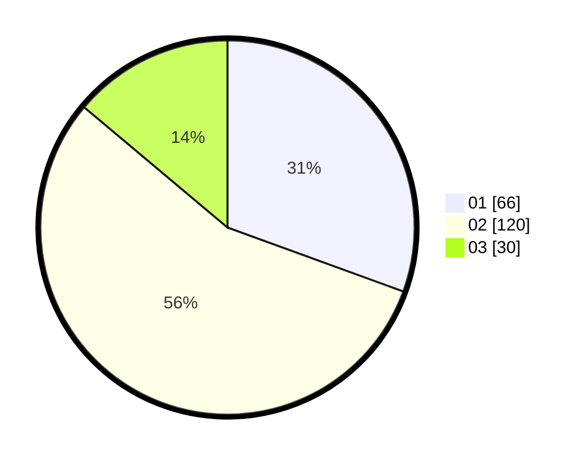

# Hasil

Hasil perolehan suara paslon dapat dilihat pada file paslon-01.txt, paslon-02.txt, dan paslon-03.txt.

Jika tidak ada, artinya data tersebut belum ada pada SIREKAP.

## Perolehan Suara

 * Paslon 01: **66**.
 * Paslon 02: **120**.
 * Paslon 03: **30**.

## Foto C Plano

https://sirekap-obj-formc.kpu.go.id/5d79/pemilu/ppwp/31/75/10/10/02/3175101002076-20240216-093612--2f425a5f-753f-4ab5-b5da-46eeeef43ba7.jpg

https://sirekap-obj-formc.kpu.go.id/5d79/pemilu/ppwp/31/75/10/10/02/3175101002076-20240216-093627--20e8f6b3-0cba-4305-98b6-09205aa07a95.jpg

https://sirekap-obj-formc.kpu.go.id/5d79/pemilu/ppwp/31/75/10/10/02/3175101002076-20240216-093619--6328308f-d3ee-452e-b217-545e5a56d2f8.jpg

## DATA PEMILIH TETAP

Jumlah pemilih dalam DPT: **258**.
 * L: **128**.
 * P: **130**.

## DATA PENGGUNA HAK PILIH

Jumlah pengguna hak pilih dalam DPT: **207**.
 * L: **97**.
 * P: **110**.

Jumlah pengguna hak pilih dalam DPTb: **1**.
 * L: **1**.
 * P: **0**.

Jumlah pengguna hak pilih dalam DPK: **9**.
 * L: **6**.
 * P: **3**.

Jumlah pengguna hak pilih: **217**.
 * L: **104**.
 * P: **113**.

## JUMLAH SUARA SAH DAN TIDAK SAH

JUMLAH SELURUH SUARA SAH: **216**.

JUMLAH SUARA TIDAK SAH: **1**.

JUMLAH SELURUH SUARA SAH DAN SUARA TIDAK SAH: **217**.
