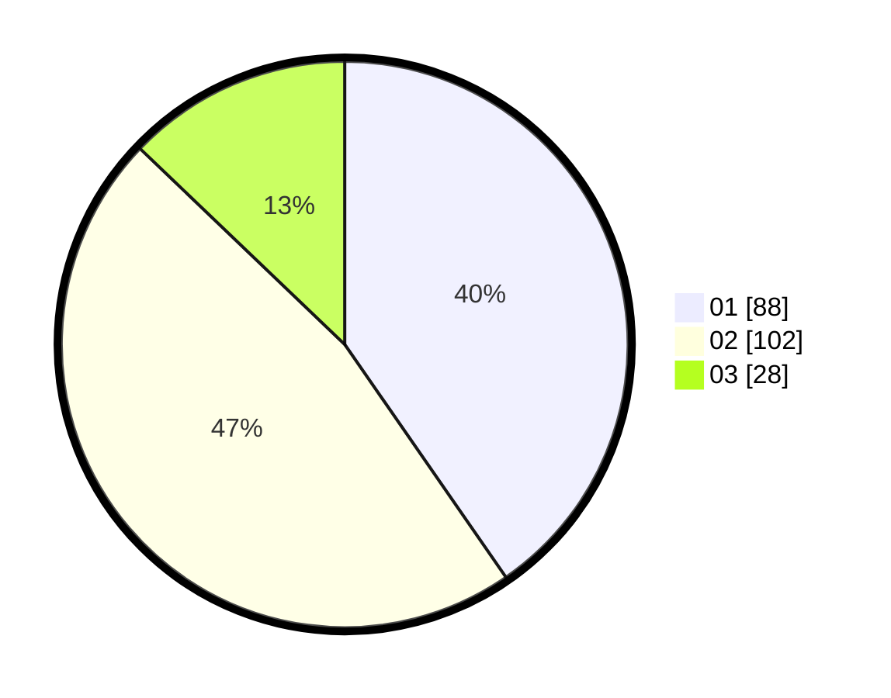

# Hasil

Hasil perolehan suara paslon dapat dilihat pada file paslon-01.txt, paslon-02.txt, dan paslon-03.txt.

Jika tidak ada, artinya data tersebut belum ada pada SIREKAP.

## Perolehan Suara

 * Paslon 01: **88**.
 * Paslon 02: **102**.
 * Paslon 03: **28**.

## Foto C Plano

https://sirekap-obj-formc.kpu.go.id/56b6/pemilu/ppwp/31/75/10/10/02/3175101002079-20240214-200002--f1648d2b-d4f7-4b2b-bb24-49048b066304.jpg

https://sirekap-obj-formc.kpu.go.id/56b6/pemilu/ppwp/31/75/10/10/02/3175101002079-20240214-200008--46fb33c1-9cba-4514-8d00-7a26cb2336cf.jpg

https://sirekap-obj-formc.kpu.go.id/56b6/pemilu/ppwp/31/75/10/10/02/3175101002079-20240214-200014--348f21be-2acd-4d21-8473-67c97dc177b3.jpg
