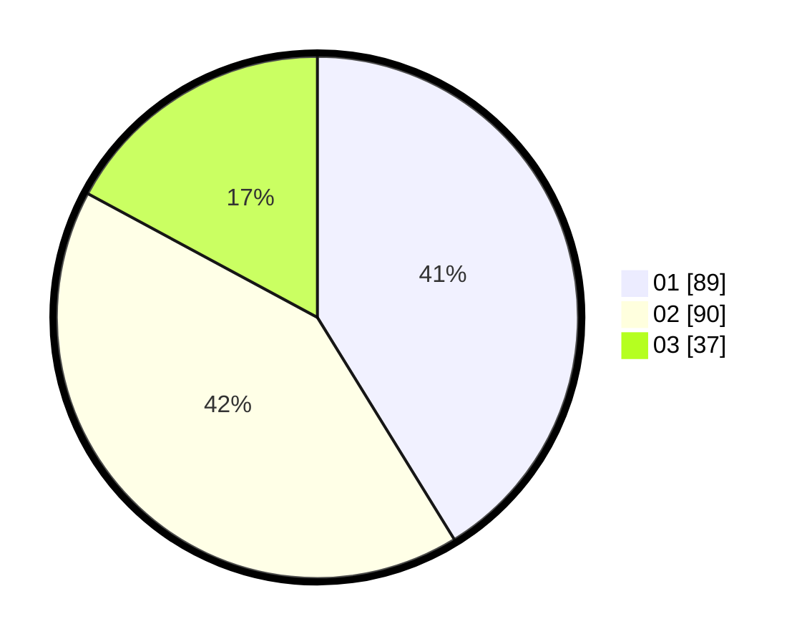

# Hasil

Hasil perolehan suara paslon dapat dilihat pada file paslon-01.txt, paslon-02.txt, dan paslon-03.txt.

Jika tidak ada, artinya data tersebut belum ada pada SIREKAP.

## Perolehan Suara

 * Paslon 01: **89**.
 * Paslon 02: **90**.
 * Paslon 03: **37**.

## Foto C Plano

https://sirekap-obj-formc.kpu.go.id/bbf5/pemilu/ppwp/31/75/10/10/02/3175101002085-20240214-190715--f7bfe245-d273-4617-9941-eb4bdce7cc61.jpg

https://sirekap-obj-formc.kpu.go.id/bbf5/pemilu/ppwp/31/75/10/10/02/3175101002085-20240214-190359--fbde2a2a-e0a6-4bad-ad84-e7f96503d8c7.jpg

https://sirekap-obj-formc.kpu.go.id/bbf5/pemilu/ppwp/31/75/10/10/02/3175101002085-20240214-190526--0baf95c4-19f5-4381-84f5-00f67033b94d.jpg

## DATA PEMILIH TETAP

Jumlah pemilih dalam DPT: **280**.
 * L: **126**.
 * P: **154**.

## DATA PENGGUNA HAK PILIH

Jumlah pengguna hak pilih dalam DPT: **216**.
 * L: **100**.
 * P: **116**.

Jumlah pengguna hak pilih dalam DPTb: **5**.
 * L: **2**.
 * P: **3**.

Jumlah pengguna hak pilih dalam DPK: **0**.
 * L: **0**.
 * P: **0**.

Jumlah pengguna hak pilih: **221**.
 * L: **102**.
 * P: **119**.

## JUMLAH SUARA SAH DAN TIDAK SAH

JUMLAH SELURUH SUARA SAH: **216**.

JUMLAH SUARA TIDAK SAH: **5**.

JUMLAH SELURUH SUARA SAH DAN SUARA TIDAK SAH: **221**.
