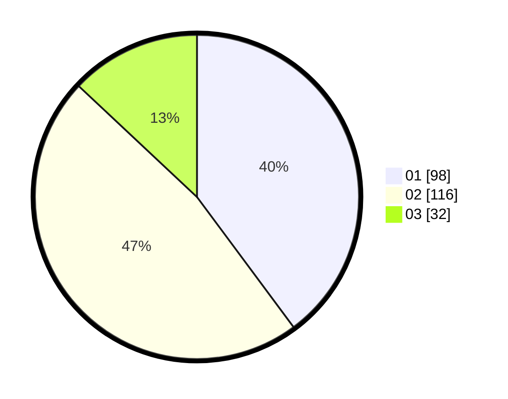

# Hasil

Hasil perolehan suara paslon dapat dilihat pada file paslon-01.txt, paslon-02.txt, dan paslon-03.txt.

Jika tidak ada, artinya data tersebut belum ada pada SIREKAP.

## Perolehan Suara

 * Paslon 01: **98**.
 * Paslon 02: **116**.
 * Paslon 03: **32**.

## Foto C Plano

https://sirekap-obj-formc.kpu.go.id/fc1c/pemilu/ppwp/31/75/10/10/02/3175101002090-20240214-225054--c6865661-2a55-4785-90e1-38fb589fa630.jpg

https://sirekap-obj-formc.kpu.go.id/fc1c/pemilu/ppwp/31/75/10/10/02/3175101002090-20240214-225156--6359da2c-afe0-45a7-b84b-c93c3869e780.jpg

https://sirekap-obj-formc.kpu.go.id/fc1c/pemilu/ppwp/31/75/10/10/02/3175101002090-20240214-225255--c20d2c62-cc53-4d4b-a769-0e04e4307318.jpg
