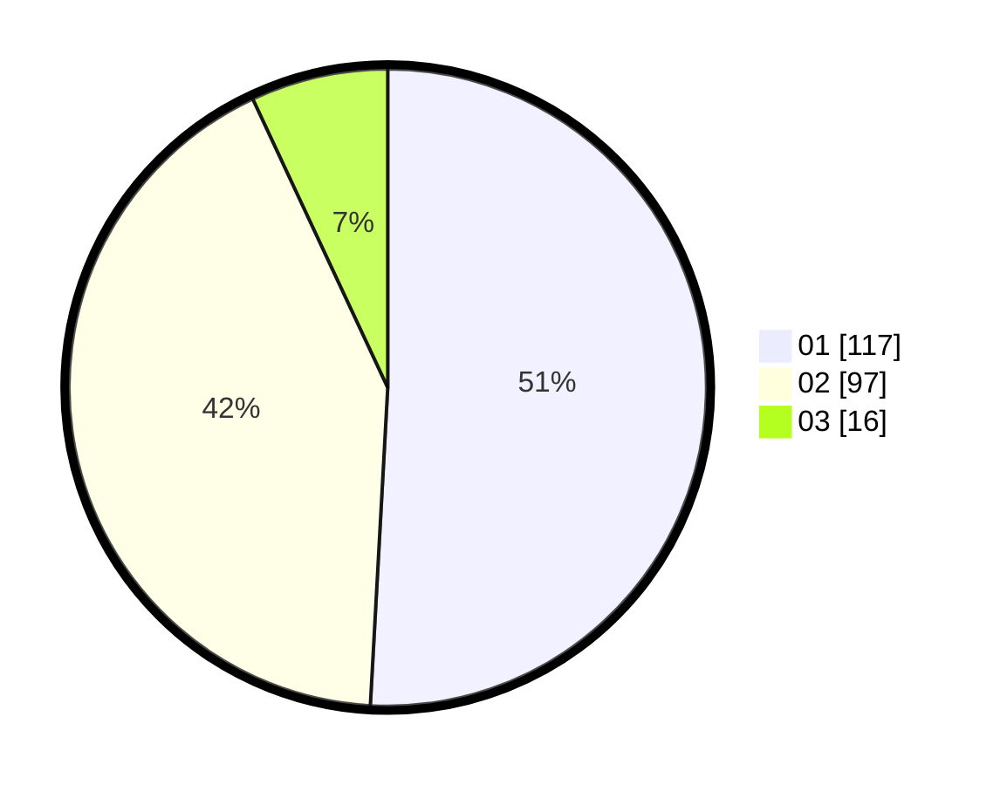

# Hasil

Hasil perolehan suara paslon dapat dilihat pada file paslon-01.txt, paslon-02.txt, dan paslon-03.txt.

Jika tidak ada, artinya data tersebut belum ada pada SIREKAP.

## Perolehan Suara

 * Paslon 01: **117**.
 * Paslon 02: **97**.
 * Paslon 03: **16**.

## Foto C Plano

https://sirekap-obj-formc.kpu.go.id/55a7/pemilu/ppwp/31/75/10/10/03/3175101003005-20240214-155831--eaa0db5c-2979-4f4e-aa1f-1f3abff3cf98.jpg

https://sirekap-obj-formc.kpu.go.id/55a7/pemilu/ppwp/31/75/10/10/03/3175101003005-20240214-192950--7bbe4bfa-6a47-42cf-a425-b2262a72bc12.jpg

https://sirekap-obj-formc.kpu.go.id/55a7/pemilu/ppwp/31/75/10/10/03/3175101003005-20240214-155914--eed3a59f-6ea5-4ad0-83db-5ca156e84b69.jpg

## DATA PEMILIH TETAP

Jumlah pemilih dalam DPT: **275**.
 * L: **143**.
 * P: **132**.

## DATA PENGGUNA HAK PILIH

Jumlah pengguna hak pilih dalam DPT: **233**.
 * L: **113**.
 * P: **120**.

Jumlah pengguna hak pilih dalam DPTb: **3**.
 * L: **2**.
 * P: **1**.

Jumlah pengguna hak pilih dalam DPK: **1**.
 * L: **1**.
 * P: **0**.

Jumlah pengguna hak pilih: **237**.
 * L: **116**.
 * P: **121**.

## JUMLAH SUARA SAH DAN TIDAK SAH

JUMLAH SELURUH SUARA SAH: **230**.

JUMLAH SUARA TIDAK SAH: **7**.

JUMLAH SELURUH SUARA SAH DAN SUARA TIDAK SAH: **237**.
