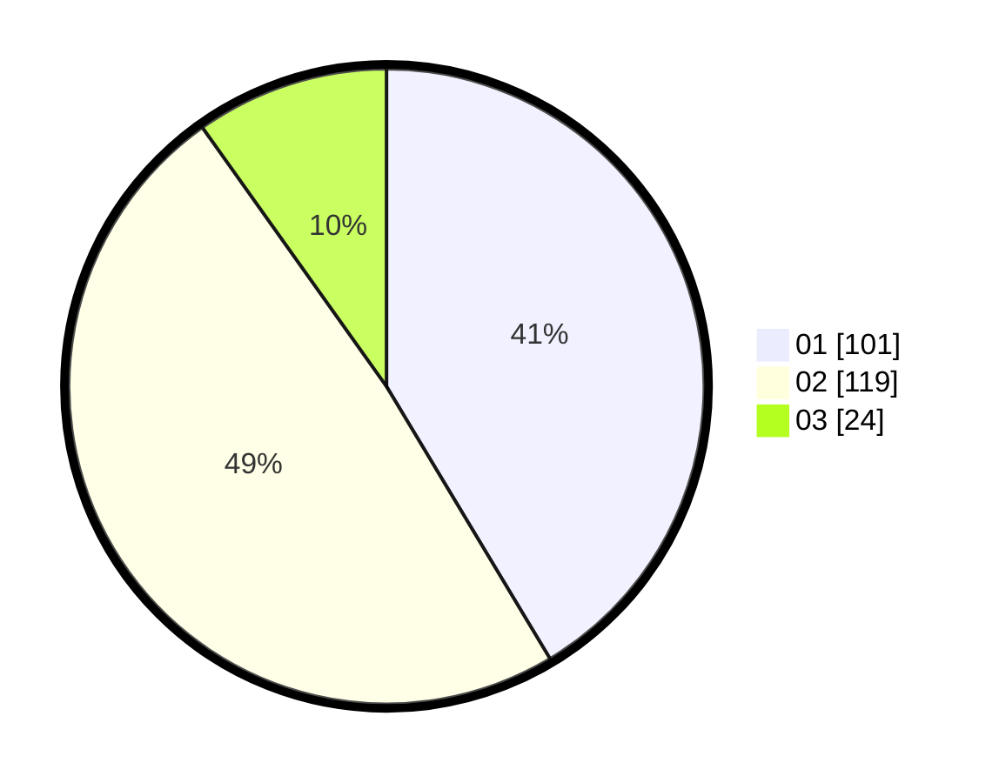

# Hasil

Hasil perolehan suara paslon dapat dilihat pada file paslon-01.txt, paslon-02.txt, dan paslon-03.txt.

Jika tidak ada, artinya data tersebut belum ada pada SIREKAP.

## Perolehan Suara

 * Paslon 01: **101**.
 * Paslon 02: **119**.
 * Paslon 03: **24**.

## Foto C Plano

https://sirekap-obj-formc.kpu.go.id/910c/pemilu/ppwp/31/75/10/10/03/3175101003006-20240214-185109--07f2330d-4a8f-43d4-8dc5-b9697be9f1fe.jpg

https://sirekap-obj-formc.kpu.go.id/910c/pemilu/ppwp/31/75/10/10/03/3175101003006-20240214-190813--7a3d3244-843a-4495-835c-12a666ed60fe.jpg

https://sirekap-obj-formc.kpu.go.id/910c/pemilu/ppwp/31/75/10/10/03/3175101003006-20240214-185317--80f110fb-3dd3-4a6a-b776-13658af56b16.jpg

## DATA PEMILIH TETAP

Jumlah pemilih dalam DPT: **278**.
 * L: **132**.
 * P: **146**.

## DATA PENGGUNA HAK PILIH

Jumlah pengguna hak pilih dalam DPT: **241**.
 * L: **115**.
 * P: **126**.

Jumlah pengguna hak pilih dalam DPTb: **5**.
 * L: **4**.
 * P: **1**.

Jumlah pengguna hak pilih dalam DPK: **0**.
 * L: **0**.
 * P: **0**.

Jumlah pengguna hak pilih: **246**.
 * L: **119**.
 * P: **127**.

## JUMLAH SUARA SAH DAN TIDAK SAH

JUMLAH SELURUH SUARA SAH: **244**.

JUMLAH SUARA TIDAK SAH: **2**.

JUMLAH SELURUH SUARA SAH DAN SUARA TIDAK SAH: **246**.
