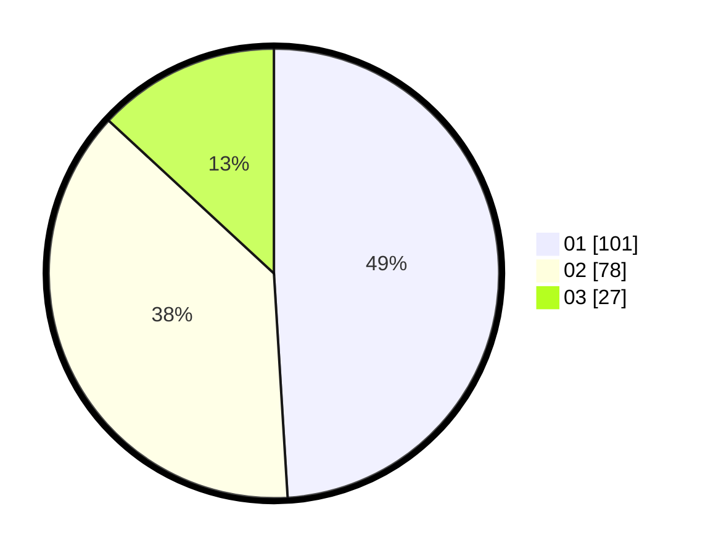

# Hasil

Hasil perolehan suara paslon dapat dilihat pada file paslon-01.txt, paslon-02.txt, dan paslon-03.txt.

Jika tidak ada, artinya data tersebut belum ada pada SIREKAP.

## Perolehan Suara

 * Paslon 01: **101**.
 * Paslon 02: **78**.
 * Paslon 03: **27**.

## Foto C Plano

https://sirekap-obj-formc.kpu.go.id/8811/pemilu/ppwp/31/75/10/10/03/3175101003025-20240214-222642--b93fb5fc-2852-4410-bc4f-0ae29a5d02cb.jpg

https://sirekap-obj-formc.kpu.go.id/8811/pemilu/ppwp/31/75/10/10/03/3175101003025-20240214-222753--b3da07be-1e0a-434a-ac56-dee8cbfd32ab.jpg

https://sirekap-obj-formc.kpu.go.id/8811/pemilu/ppwp/31/75/10/10/03/3175101003025-20240215-020655--bb2a92a3-80da-4d5d-af33-3e44ed000f71.jpg
