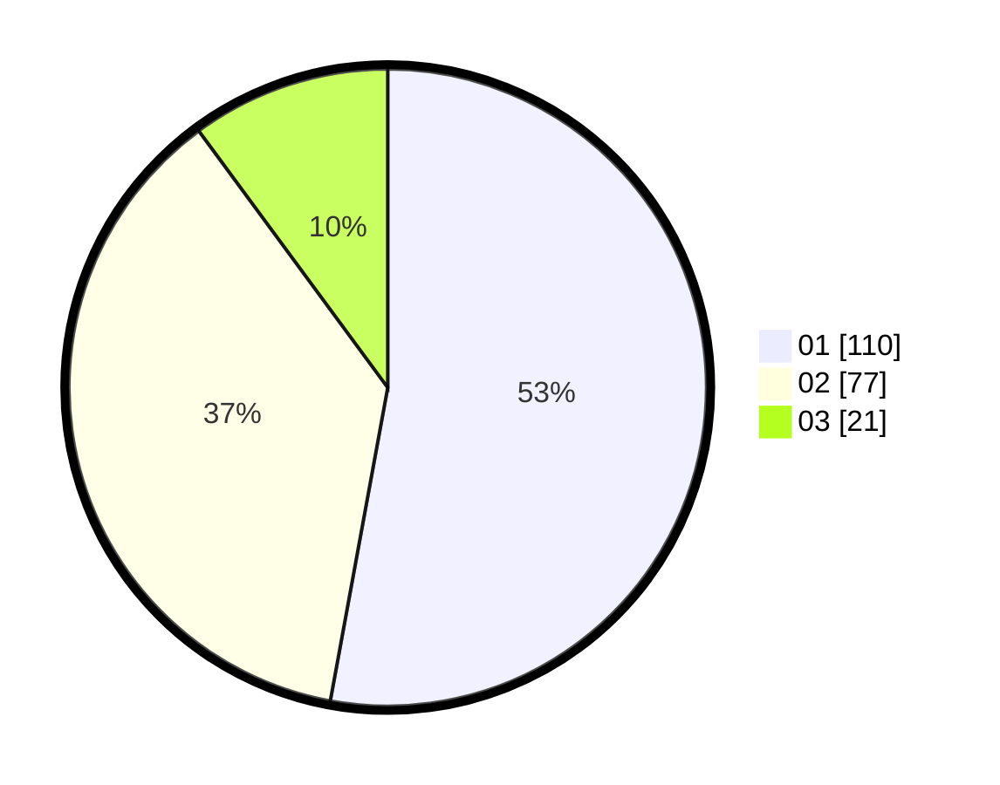

# Hasil

Hasil perolehan suara paslon dapat dilihat pada file paslon-01.txt, paslon-02.txt, dan paslon-03.txt.

Jika tidak ada, artinya data tersebut belum ada pada SIREKAP.

## Perolehan Suara

 * Paslon 01: **110**.
 * Paslon 02: **77**.
 * Paslon 03: **21**.

## Foto C Plano

https://sirekap-obj-formc.kpu.go.id/9601/pemilu/ppwp/31/75/10/10/03/3175101003028-20240214-200157--470a6e63-253a-4319-8916-60379c828a63.jpg

https://sirekap-obj-formc.kpu.go.id/9601/pemilu/ppwp/31/75/10/10/03/3175101003028-20240214-192351--10ff1626-35ce-4850-a0a5-b617c126b4be.jpg

https://sirekap-obj-formc.kpu.go.id/9601/pemilu/ppwp/31/75/10/10/03/3175101003028-20240214-192850--fd9e38b4-b826-4d90-97ac-f5a6cec96dba.jpg

## DATA PEMILIH TETAP

Jumlah pemilih dalam DPT: **250**.
 * L: **124**.
 * P: **126**.

## DATA PENGGUNA HAK PILIH

Jumlah pengguna hak pilih dalam DPT: **206**.
 * L: **96**.
 * P: **110**.

Jumlah pengguna hak pilih dalam DPTb: **0**.
 * L: **0**.
 * P: **0**.

Jumlah pengguna hak pilih dalam DPK: **4**.
 * L: **1**.
 * P: **3**.

Jumlah pengguna hak pilih: **210**.
 * L: **97**.
 * P: **113**.

## JUMLAH SUARA SAH DAN TIDAK SAH

JUMLAH SELURUH SUARA SAH: **208**.

JUMLAH SUARA TIDAK SAH: **2**.

JUMLAH SELURUH SUARA SAH DAN SUARA TIDAK SAH: **210**.
