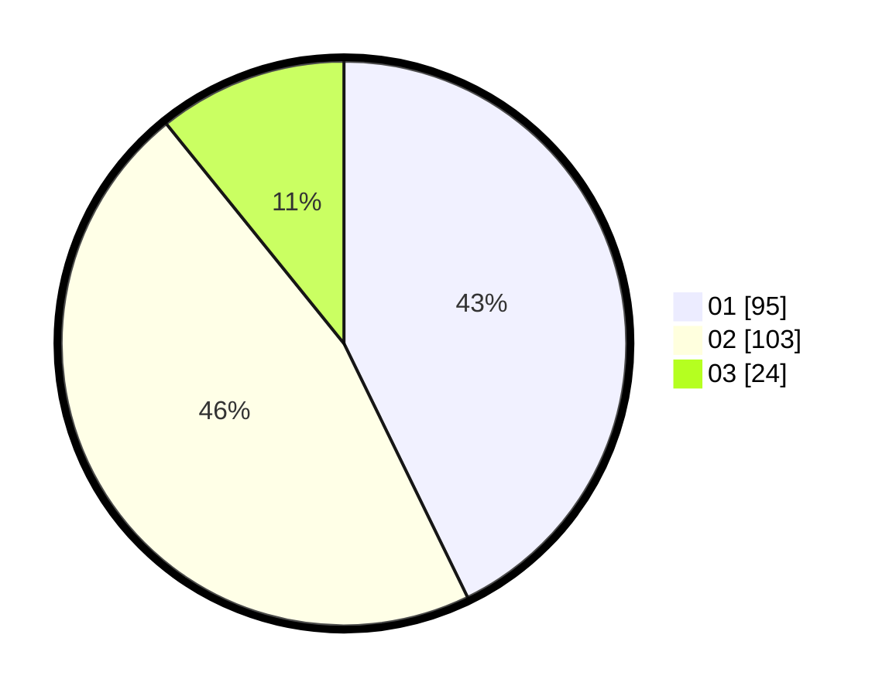

# Hasil

Hasil perolehan suara paslon dapat dilihat pada file paslon-01.txt, paslon-02.txt, dan paslon-03.txt.

Jika tidak ada, artinya data tersebut belum ada pada SIREKAP.

## Perolehan Suara

 * Paslon 01: **95**.
 * Paslon 02: **103**.
 * Paslon 03: **24**.

## Foto C Plano

https://sirekap-obj-formc.kpu.go.id/924c/pemilu/ppwp/31/75/10/10/03/3175101003043-20240214-155409--89dcf582-0f8f-4083-b11c-3f135c3192ba.jpg

https://sirekap-obj-formc.kpu.go.id/924c/pemilu/ppwp/31/75/10/10/03/3175101003043-20240214-195226--428d8daf-9048-4acd-85fe-59c4a3362f30.jpg

https://sirekap-obj-formc.kpu.go.id/924c/pemilu/ppwp/31/75/10/10/03/3175101003043-20240214-204500--faf765e9-126c-4398-8dd0-f39a9e77289d.jpg

## DATA PEMILIH TETAP

Jumlah pemilih dalam DPT: **250**.
 * L: **116**.
 * P: **134**.

## DATA PENGGUNA HAK PILIH

Jumlah pengguna hak pilih dalam DPT: **217**.
 * L: **97**.
 * P: **120**.

Jumlah pengguna hak pilih dalam DPTb: **3**.
 * L: **2**.
 * P: **1**.

Jumlah pengguna hak pilih dalam DPK: **2**.
 * L: **1**.
 * P: **1**.

Jumlah pengguna hak pilih: **222**.
 * L: **100**.
 * P: **122**.

## JUMLAH SUARA SAH DAN TIDAK SAH

JUMLAH SELURUH SUARA SAH: **222**.

JUMLAH SUARA TIDAK SAH: **0**.

JUMLAH SELURUH SUARA SAH DAN SUARA TIDAK SAH: **222**.
