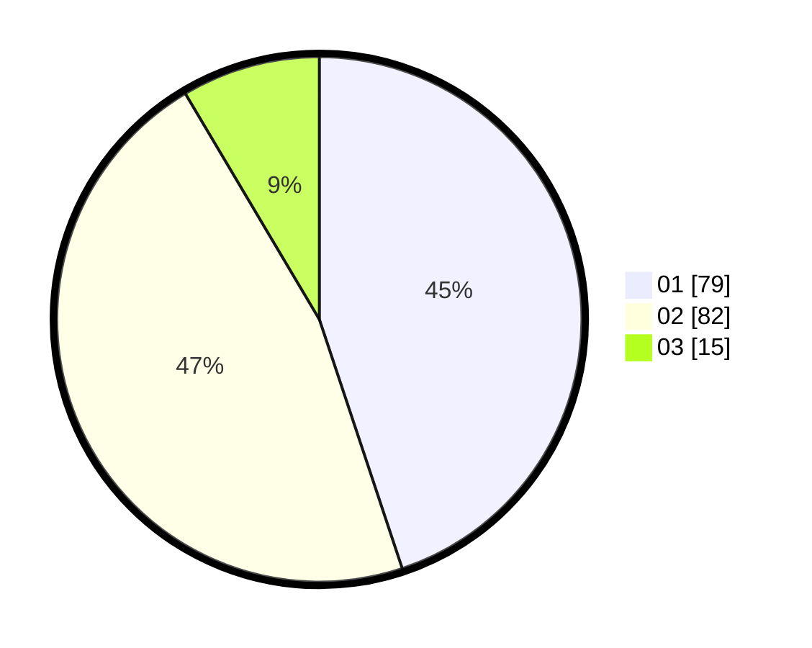

# Hasil

Hasil perolehan suara paslon dapat dilihat pada file paslon-01.txt, paslon-02.txt, dan paslon-03.txt.

Jika tidak ada, artinya data tersebut belum ada pada SIREKAP.

## Perolehan Suara

 * Paslon 01: **79**.
 * Paslon 02: **82**.
 * Paslon 03: **15**.

## Foto C Plano

https://sirekap-obj-formc.kpu.go.id/463b/pemilu/ppwp/31/75/10/10/03/3175101003049-20240214-141655--e4b32b4f-3bcd-42ee-b2a7-7c1eac15b8a9.jpg

https://sirekap-obj-formc.kpu.go.id/463b/pemilu/ppwp/31/75/10/10/03/3175101003049-20240214-141842--eb2b1c25-9bbc-42d5-9654-5696ca89e658.jpg

https://sirekap-obj-formc.kpu.go.id/463b/pemilu/ppwp/31/75/10/10/03/3175101003049-20240214-141910--4617e7ab-e7e7-4e12-a138-37b54b223c9d.jpg
