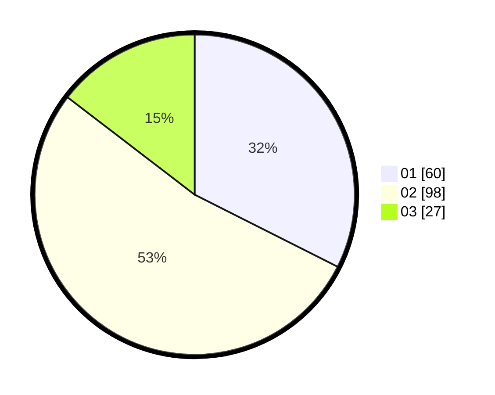

# Hasil

Hasil perolehan suara paslon dapat dilihat pada file paslon-01.txt, paslon-02.txt, dan paslon-03.txt.

Jika tidak ada, artinya data tersebut belum ada pada SIREKAP.

## Perolehan Suara

 * Paslon 01: **60**.
 * Paslon 02: **98**.
 * Paslon 03: **27**.

## Foto C Plano

https://sirekap-obj-formc.kpu.go.id/c291/pemilu/ppwp/31/75/10/10/03/3175101003052-20240214-155818--cc20a0af-3c5d-4a51-a57b-cbf017988d12.jpg

https://sirekap-obj-formc.kpu.go.id/c291/pemilu/ppwp/31/75/10/10/03/3175101003052-20240214-160103--ae787ef0-18e5-408a-81ad-b34244d373a0.jpg

https://sirekap-obj-formc.kpu.go.id/c291/pemilu/ppwp/31/75/10/10/03/3175101003052-20240214-160115--d93e9a99-59d2-4530-851b-29dd94235f97.jpg

## DATA PEMILIH TETAP

Jumlah pemilih dalam DPT: **260**.
 * L: **126**.
 * P: **134**.

## DATA PENGGUNA HAK PILIH

Jumlah pengguna hak pilih dalam DPT: **182**.
 * L: **86**.
 * P: **96**.

Jumlah pengguna hak pilih dalam DPTb: **5**.
 * L: **1**.
 * P: **4**.

Jumlah pengguna hak pilih dalam DPK: **2**.
 * L: **2**.
 * P: **0**.

Jumlah pengguna hak pilih: **189**.
 * L: **89**.
 * P: **100**.

## JUMLAH SUARA SAH DAN TIDAK SAH

JUMLAH SELURUH SUARA SAH: **185**.

JUMLAH SUARA TIDAK SAH: **4**.

JUMLAH SELURUH SUARA SAH DAN SUARA TIDAK SAH: **189**.
