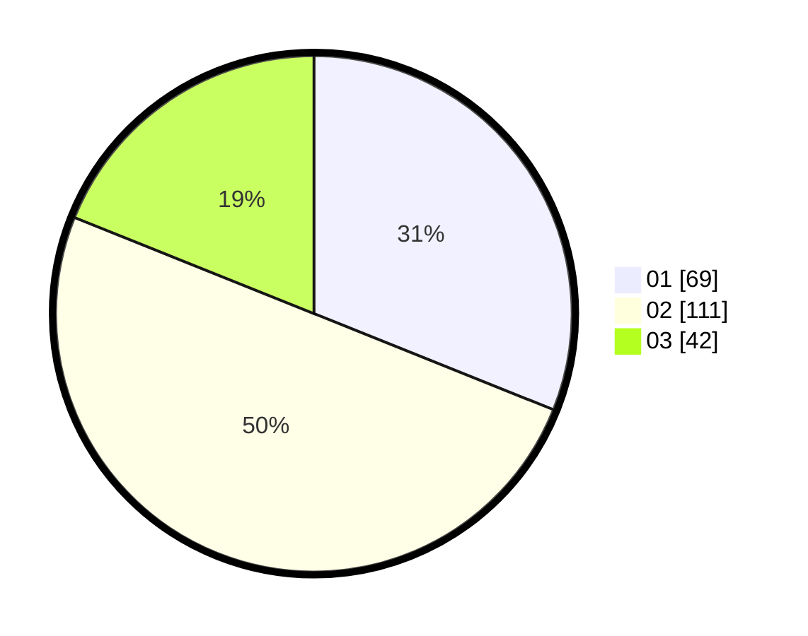

# Hasil

Hasil perolehan suara paslon dapat dilihat pada file paslon-01.txt, paslon-02.txt, dan paslon-03.txt.

Jika tidak ada, artinya data tersebut belum ada pada SIREKAP.

## Perolehan Suara

 * Paslon 01: **69**.
 * Paslon 02: **111**.
 * Paslon 03: **42**.

## Foto C Plano

https://sirekap-obj-formc.kpu.go.id/585b/pemilu/ppwp/31/75/10/10/03/3175101003053-20240214-155657--2156441a-f83e-4667-9b80-cab2a839c6f9.jpg

https://sirekap-obj-formc.kpu.go.id/585b/pemilu/ppwp/31/75/10/10/03/3175101003053-20240214-155704--aff31c79-d98d-4eef-94f1-c9f1f7443d18.jpg

https://sirekap-obj-formc.kpu.go.id/585b/pemilu/ppwp/31/75/10/10/03/3175101003053-20240214-192437--c08f3dd9-daf7-426b-9a85-899f3bf8f92f.jpg

## DATA PEMILIH TETAP

Jumlah pemilih dalam DPT: **259**.
 * L: **135**.
 * P: **124**.

## DATA PENGGUNA HAK PILIH

Jumlah pengguna hak pilih dalam DPT: **224**.
 * L: **114**.
 * P: **110**.

Jumlah pengguna hak pilih dalam DPTb: **4**.
 * L: **4**.
 * P: **0**.

Jumlah pengguna hak pilih dalam DPK: **1**.
 * L: **0**.
 * P: **1**.

Jumlah pengguna hak pilih: **229**.
 * L: **118**.
 * P: **111**.

## JUMLAH SUARA SAH DAN TIDAK SAH

JUMLAH SELURUH SUARA SAH: **222**.

JUMLAH SUARA TIDAK SAH: **7**.

JUMLAH SELURUH SUARA SAH DAN SUARA TIDAK SAH: **229**.
