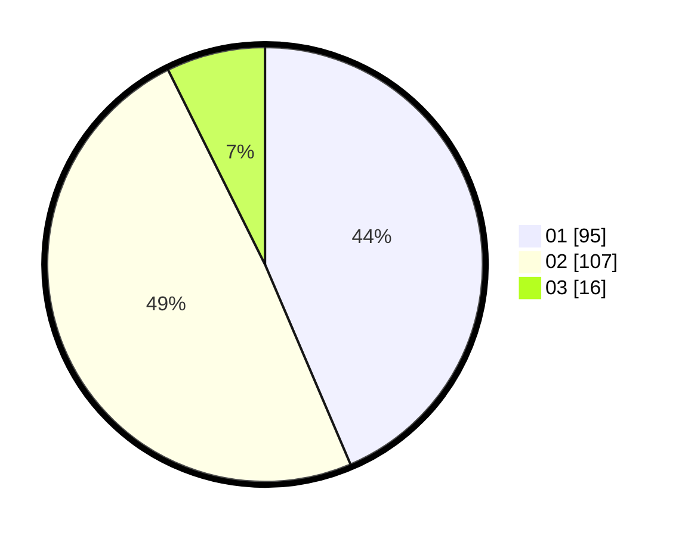

# Hasil

Hasil perolehan suara paslon dapat dilihat pada file paslon-01.txt, paslon-02.txt, dan paslon-03.txt.

Jika tidak ada, artinya data tersebut belum ada pada SIREKAP.

## Perolehan Suara

 * Paslon 01: **95**.
 * Paslon 02: **107**.
 * Paslon 03: **16**.

## Foto C Plano

https://sirekap-obj-formc.kpu.go.id/57d9/pemilu/ppwp/31/75/10/10/03/3175101003064-20240214-201027--d640a200-c52a-4bd0-9421-992b688c30c9.jpg

https://sirekap-obj-formc.kpu.go.id/57d9/pemilu/ppwp/31/75/10/10/03/3175101003064-20240214-201115--7705d20a-640c-482c-83eb-62668237afdb.jpg

https://sirekap-obj-formc.kpu.go.id/57d9/pemilu/ppwp/31/75/10/10/03/3175101003064-20240214-201205--a0020abd-5fa7-4c43-a4df-6fa904466f2a.jpg

## DATA PEMILIH TETAP

Jumlah pemilih dalam DPT: **256**.
 * L: **124**.
 * P: **132**.

## DATA PENGGUNA HAK PILIH

Jumlah pengguna hak pilih dalam DPT: **218**.
 * L: **102**.
 * P: **116**.

Jumlah pengguna hak pilih dalam DPTb: **1**.
 * L: **0**.
 * P: **1**.

Jumlah pengguna hak pilih dalam DPK: **4**.
 * L: **1**.
 * P: **3**.

Jumlah pengguna hak pilih: **223**.
 * L: **103**.
 * P: **120**.

## JUMLAH SUARA SAH DAN TIDAK SAH

JUMLAH SELURUH SUARA SAH: **218**.

JUMLAH SUARA TIDAK SAH: **5**.

JUMLAH SELURUH SUARA SAH DAN SUARA TIDAK SAH: **223**.
