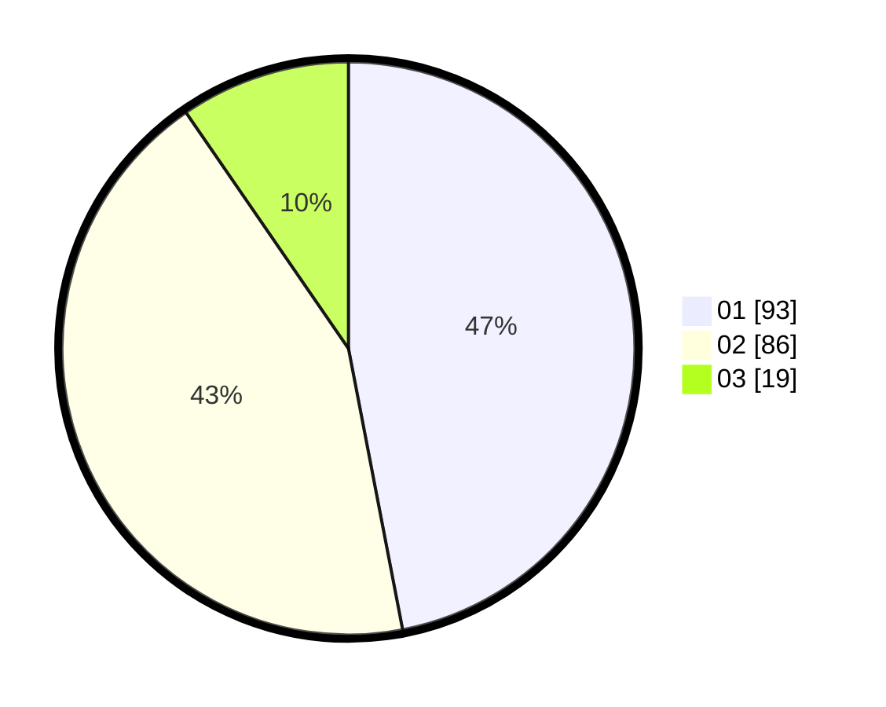

# Hasil

Hasil perolehan suara paslon dapat dilihat pada file paslon-01.txt, paslon-02.txt, dan paslon-03.txt.

Jika tidak ada, artinya data tersebut belum ada pada SIREKAP.

## Perolehan Suara

 * Paslon 01: **93**.
 * Paslon 02: **86**.
 * Paslon 03: **19**.

## Foto C Plano

https://sirekap-obj-formc.kpu.go.id/44da/pemilu/ppwp/31/75/10/10/03/3175101003080-20240214-234431--257adf04-ea44-453e-a8d7-4dd6295d082f.jpg

https://sirekap-obj-formc.kpu.go.id/44da/pemilu/ppwp/31/75/10/10/03/3175101003080-20240214-234610--d16dd241-1edd-4789-a96a-d1ed1ca4d8d1.jpg
