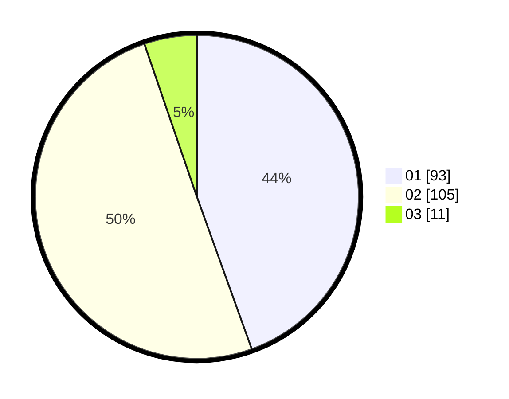

# Hasil

Hasil perolehan suara paslon dapat dilihat pada file paslon-01.txt, paslon-02.txt, dan paslon-03.txt.

Jika tidak ada, artinya data tersebut belum ada pada SIREKAP.

## Perolehan Suara

 * Paslon 01: **93**.
 * Paslon 02: **105**.
 * Paslon 03: **11**.

## Foto C Plano

https://sirekap-obj-formc.kpu.go.id/37c2/pemilu/ppwp/31/75/10/10/03/3175101003083-20240214-195536--00d13d7a-d00c-4d52-83c1-e2d3685c5b8f.jpg

https://sirekap-obj-formc.kpu.go.id/37c2/pemilu/ppwp/31/75/10/10/03/3175101003083-20240214-195553--30b1c7df-c5f8-4ffb-ad0e-43f4f57e1dd1.jpg

https://sirekap-obj-formc.kpu.go.id/37c2/pemilu/ppwp/31/75/10/10/03/3175101003083-20240214-195604--5d8ef7b7-5b62-489a-916d-d13dc67e40bc.jpg

## DATA PEMILIH TETAP

Jumlah pemilih dalam DPT: **257**.
 * L: **125**.
 * P: **132**.

## DATA PENGGUNA HAK PILIH

Jumlah pengguna hak pilih dalam DPT: **208**.
 * L: **98**.
 * P: **110**.

Jumlah pengguna hak pilih dalam DPTb: **3**.
 * L: **2**.
 * P: **1**.

Jumlah pengguna hak pilih dalam DPK: **0**.
 * L: **0**.
 * P: **0**.

Jumlah pengguna hak pilih: **211**.
 * L: **100**.
 * P: **111**.

## JUMLAH SUARA SAH DAN TIDAK SAH

JUMLAH SELURUH SUARA SAH: **209**.

JUMLAH SUARA TIDAK SAH: **2**.

JUMLAH SELURUH SUARA SAH DAN SUARA TIDAK SAH: **211**.
