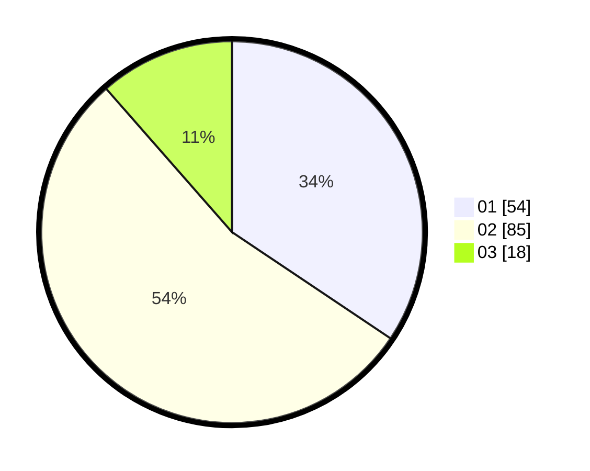

# Hasil

Hasil perolehan suara paslon dapat dilihat pada file paslon-01.txt, paslon-02.txt, dan paslon-03.txt.

Jika tidak ada, artinya data tersebut belum ada pada SIREKAP.

## Perolehan Suara

 * Paslon 01: **54**.
 * Paslon 02: **85**.
 * Paslon 03: **18**.

## Foto C Plano

https://sirekap-obj-formc.kpu.go.id/0a6f/pemilu/ppwp/31/75/10/10/03/3175101003091-20240214-190422--326c60db-7f94-4f39-bf7a-7cb3f5cc9356.jpg

https://sirekap-obj-formc.kpu.go.id/0a6f/pemilu/ppwp/31/75/10/10/03/3175101003091-20240214-190907--bb931d08-d043-4ce0-b5f4-a748849d58f7.jpg

https://sirekap-obj-formc.kpu.go.id/0a6f/pemilu/ppwp/31/75/10/10/03/3175101003091-20240214-191459--dabc0fa6-b6c1-4bb8-8422-33d3cc385dd6.jpg

## DATA PEMILIH TETAP

Jumlah pemilih dalam DPT: **216**.
 * L: **102**.
 * P: **114**.

## DATA PENGGUNA HAK PILIH

Jumlah pengguna hak pilih dalam DPT: **155**.
 * L: **73**.
 * P: **82**.

Jumlah pengguna hak pilih dalam DPTb: **0**.
 * L: **0**.
 * P: **0**.

Jumlah pengguna hak pilih dalam DPK: **5**.
 * L: **2**.
 * P: **3**.

Jumlah pengguna hak pilih: **160**.
 * L: **75**.
 * P: **85**.

## JUMLAH SUARA SAH DAN TIDAK SAH

JUMLAH SELURUH SUARA SAH: **157**.

JUMLAH SUARA TIDAK SAH: **3**.

JUMLAH SELURUH SUARA SAH DAN SUARA TIDAK SAH: **160**.
