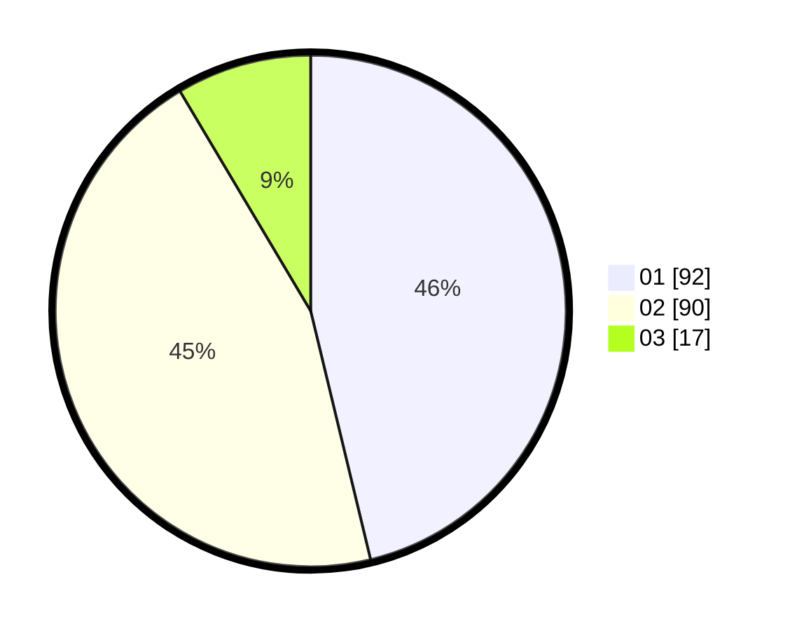

# Hasil

Hasil perolehan suara paslon dapat dilihat pada file paslon-01.txt, paslon-02.txt, dan paslon-03.txt.

Jika tidak ada, artinya data tersebut belum ada pada SIREKAP.

## Perolehan Suara

 * Paslon 01: **92**.
 * Paslon 02: **90**.
 * Paslon 03: **17**.

## Foto C Plano

https://sirekap-obj-formc.kpu.go.id/7a69/pemilu/ppwp/31/75/10/10/03/3175101003092-20240214-214627--d8cd4bc4-a990-4bf1-809d-83d31458e2c8.jpg

https://sirekap-obj-formc.kpu.go.id/7a69/pemilu/ppwp/31/75/10/10/03/3175101003092-20240214-214759--e33ba549-157c-4836-a886-a32b5dad2242.jpg

https://sirekap-obj-formc.kpu.go.id/7a69/pemilu/ppwp/31/75/10/10/03/3175101003092-20240214-214904--5eaaf19d-178d-4a90-96a7-57d446337cee.jpg
