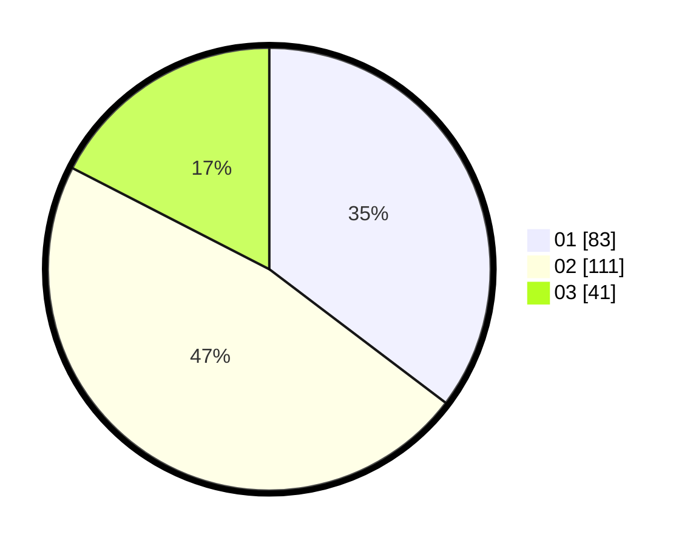

# Hasil

Hasil perolehan suara paslon dapat dilihat pada file paslon-01.txt, paslon-02.txt, dan paslon-03.txt.

Jika tidak ada, artinya data tersebut belum ada pada SIREKAP.

## Perolehan Suara

 * Paslon 01: **83**.
 * Paslon 02: **111**.
 * Paslon 03: **41**.

## Foto C Plano

https://sirekap-obj-formc.kpu.go.id/5ff2/pemilu/ppwp/31/75/10/10/03/3175101003094-20240214-191127--289ad57b-aeb3-43dc-8b77-2f61f5e80983.jpg

https://sirekap-obj-formc.kpu.go.id/5ff2/pemilu/ppwp/31/75/10/10/03/3175101003094-20240214-190246--1a3262a4-b6d1-48e6-aa94-07380d13f38a.jpg

https://sirekap-obj-formc.kpu.go.id/5ff2/pemilu/ppwp/31/75/10/10/03/3175101003094-20240214-190348--266d8152-6430-4735-9041-54f57745d14a.jpg

## DATA PEMILIH TETAP

Jumlah pemilih dalam DPT: **272**.
 * L: **141**.
 * P: **131**.

## DATA PENGGUNA HAK PILIH

Jumlah pengguna hak pilih dalam DPT: **231**.
 * L: **105**.
 * P: **126**.

Jumlah pengguna hak pilih dalam DPTb: **3**.
 * L: **1**.
 * P: **2**.

Jumlah pengguna hak pilih dalam DPK: **6**.
 * L: **4**.
 * P: **2**.

Jumlah pengguna hak pilih: **240**.
 * L: **110**.
 * P: **130**.

## JUMLAH SUARA SAH DAN TIDAK SAH

JUMLAH SELURUH SUARA SAH: **235**.

JUMLAH SUARA TIDAK SAH: **5**.

JUMLAH SELURUH SUARA SAH DAN SUARA TIDAK SAH: **240**.
