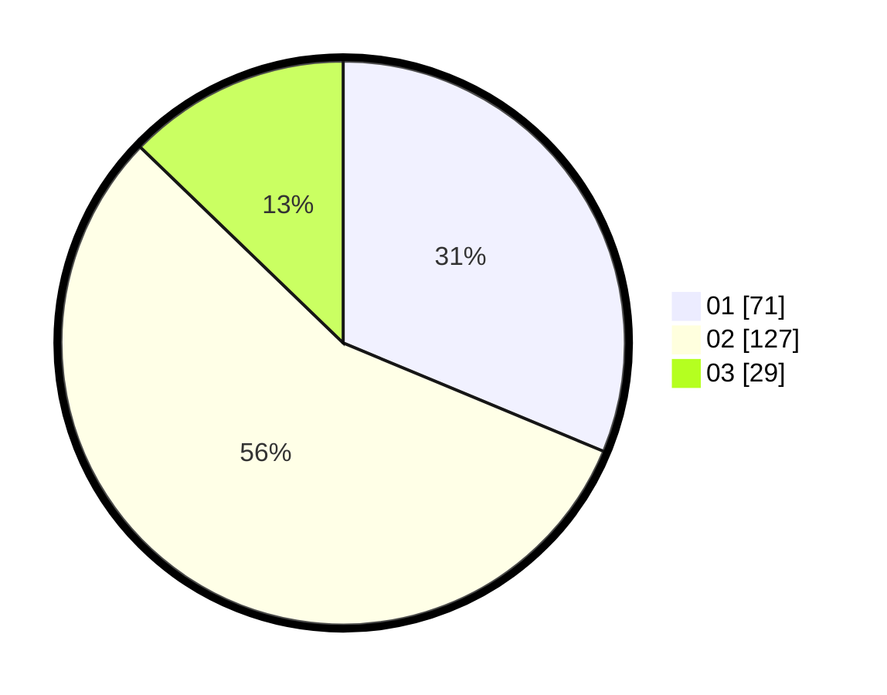

# Hasil

Hasil perolehan suara paslon dapat dilihat pada file paslon-01.txt, paslon-02.txt, dan paslon-03.txt.

Jika tidak ada, artinya data tersebut belum ada pada SIREKAP.

## Perolehan Suara

 * Paslon 01: **71**.
 * Paslon 02: **127**.
 * Paslon 03: **29**.

## Foto C Plano

https://sirekap-obj-formc.kpu.go.id/c22a/pemilu/ppwp/31/75/10/10/03/3175101003095-20240216-024748--ee2dc335-3f0d-48bf-88eb-ac9880f560f8.jpg

https://sirekap-obj-formc.kpu.go.id/c22a/pemilu/ppwp/31/75/10/10/03/3175101003095-20240216-024750--3519c58b-4843-416c-8efd-14657ecaffa8.jpg

https://sirekap-obj-formc.kpu.go.id/c22a/pemilu/ppwp/31/75/10/10/03/3175101003095-20240216-024749--0a657e95-2b83-4111-bed5-30a11414bcb0.jpg

## DATA PEMILIH TETAP

Jumlah pemilih dalam DPT: **280**.
 * L: **133**.
 * P: **147**.

## DATA PENGGUNA HAK PILIH

Jumlah pengguna hak pilih dalam DPT: **229**.
 * L: **105**.
 * P: **124**.

Jumlah pengguna hak pilih dalam DPTb: **0**.
 * L: **0**.
 * P: **0**.

Jumlah pengguna hak pilih dalam DPK: **0**.
 * L: **0**.
 * P: **0**.

Jumlah pengguna hak pilih: **229**.
 * L: **105**.
 * P: **124**.

## JUMLAH SUARA SAH DAN TIDAK SAH

JUMLAH SELURUH SUARA SAH: **227**.

JUMLAH SUARA TIDAK SAH: **2**.

JUMLAH SELURUH SUARA SAH DAN SUARA TIDAK SAH: **229**.
