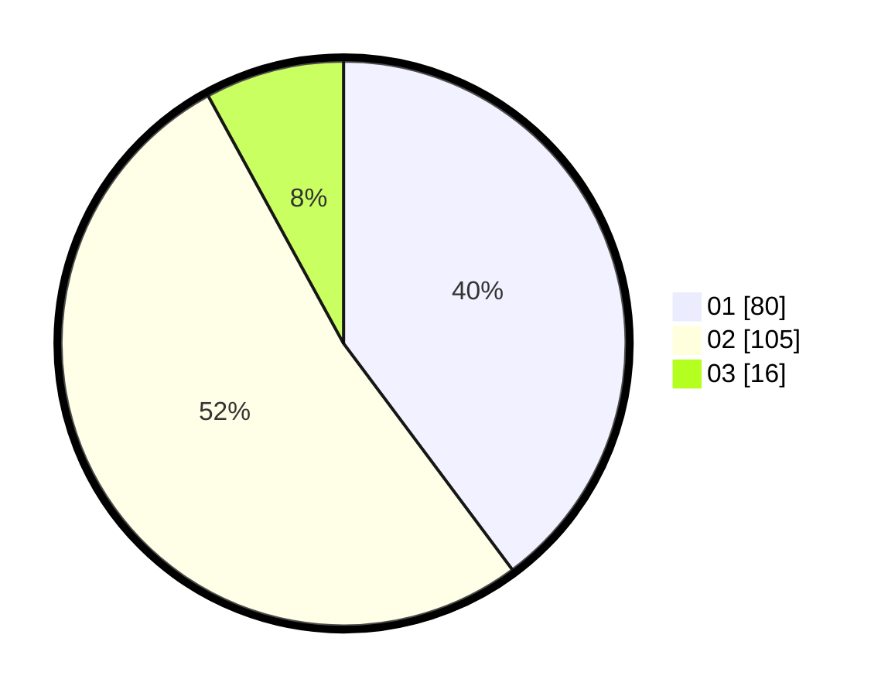

# Hasil

Hasil perolehan suara paslon dapat dilihat pada file paslon-01.txt, paslon-02.txt, dan paslon-03.txt.

Jika tidak ada, artinya data tersebut belum ada pada SIREKAP.

## Perolehan Suara

 * Paslon 01: **80**.
 * Paslon 02: **105**.
 * Paslon 03: **16**.

## Foto C Plano

https://sirekap-obj-formc.kpu.go.id/70d4/pemilu/ppwp/31/75/10/10/04/3175101004007-20240216-011710--2e3ee0b6-ff6d-4479-8929-50ca8b7c7d7f.jpg

https://sirekap-obj-formc.kpu.go.id/70d4/pemilu/ppwp/31/75/10/10/04/3175101004007-20240216-012958--f9084e19-3bef-48fe-a43f-c42e9ace4b1c.jpg

https://sirekap-obj-formc.kpu.go.id/70d4/pemilu/ppwp/31/75/10/10/04/3175101004007-20240216-011718--8997a3dc-f332-47e8-a85f-1d5c64496d5b.jpg

## DATA PEMILIH TETAP

Jumlah pemilih dalam DPT: **265**.
 * L: **122**.
 * P: **143**.

## DATA PENGGUNA HAK PILIH

Jumlah pengguna hak pilih dalam DPT: **204**.
 * L: **91**.
 * P: **113**.

Jumlah pengguna hak pilih dalam DPTb: **1**.
 * L: **0**.
 * P: **1**.

Jumlah pengguna hak pilih dalam DPK: **0**.
 * L: **0**.
 * P: **0**.

Jumlah pengguna hak pilih: **205**.
 * L: **91**.
 * P: **114**.

## JUMLAH SUARA SAH DAN TIDAK SAH

JUMLAH SELURUH SUARA SAH: **201**.

JUMLAH SUARA TIDAK SAH: **4**.

JUMLAH SELURUH SUARA SAH DAN SUARA TIDAK SAH: **205**.
