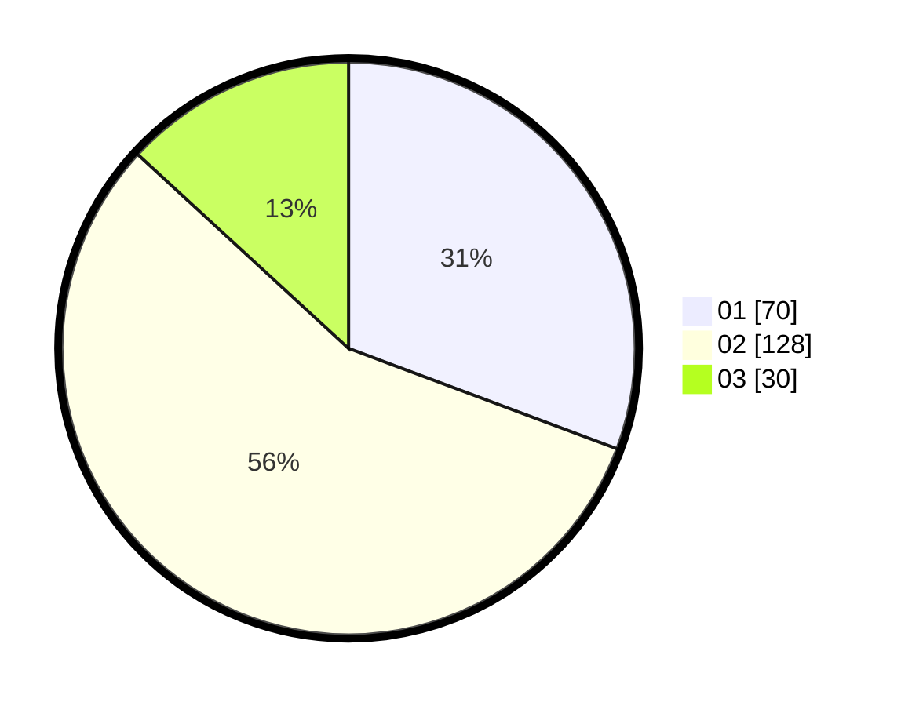

# Hasil

Hasil perolehan suara paslon dapat dilihat pada file paslon-01.txt, paslon-02.txt, dan paslon-03.txt.

Jika tidak ada, artinya data tersebut belum ada pada SIREKAP.

## Perolehan Suara

 * Paslon 01: **70**.
 * Paslon 02: **128**.
 * Paslon 03: **30**.

## Foto C Plano

https://sirekap-obj-formc.kpu.go.id/026c/pemilu/ppwp/31/75/10/10/04/3175101004019-20240218-110420--b4bc989f-f4a9-4707-bbd2-e57396ba61d8.jpg

https://sirekap-obj-formc.kpu.go.id/026c/pemilu/ppwp/31/75/10/10/04/3175101004019-20240216-134255--1d6258fc-0559-40b5-bde0-ccb0a4cc4b7b.jpg

https://sirekap-obj-formc.kpu.go.id/026c/pemilu/ppwp/31/75/10/10/04/3175101004019-20240217-124630--b28b849e-ce7d-4fde-bcb4-cf7799f49540.jpg
