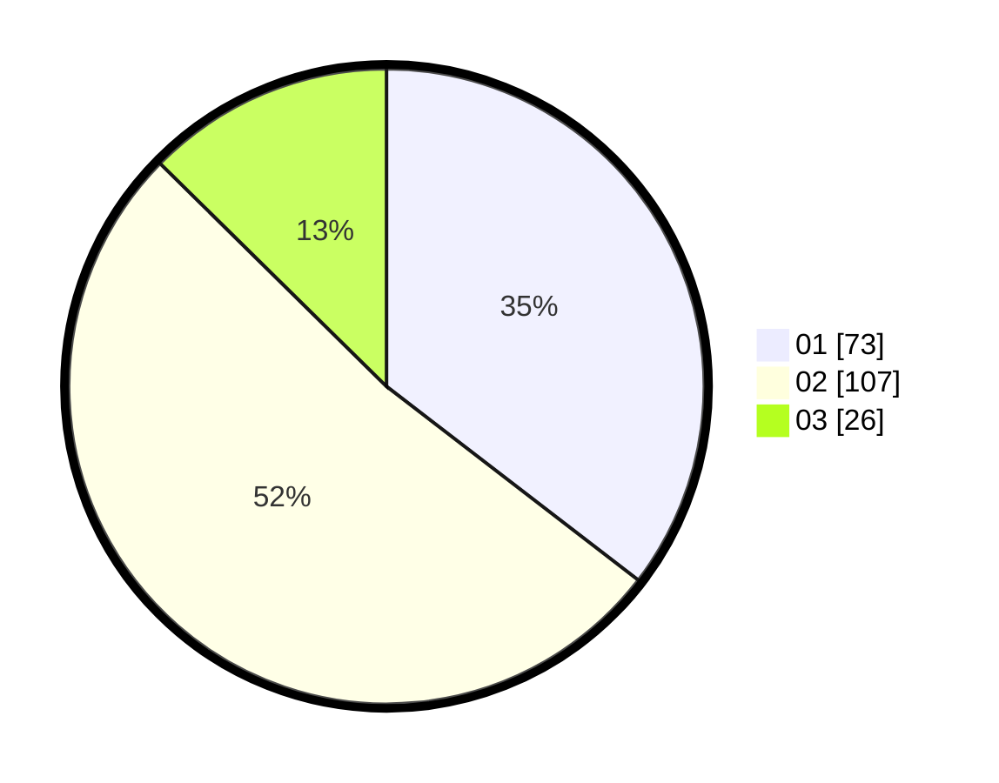

# Hasil

Hasil perolehan suara paslon dapat dilihat pada file paslon-01.txt, paslon-02.txt, dan paslon-03.txt.

Jika tidak ada, artinya data tersebut belum ada pada SIREKAP.

## Perolehan Suara

 * Paslon 01: **73**.
 * Paslon 02: **107**.
 * Paslon 03: **26**.

## Foto C Plano

https://sirekap-obj-formc.kpu.go.id/9e59/pemilu/ppwp/31/75/10/10/04/3175101004021-20240214-155839--6be7f619-653b-4f7a-83ba-0c855d6ac2c4.jpg

https://sirekap-obj-formc.kpu.go.id/9e59/pemilu/ppwp/31/75/10/10/04/3175101004021-20240216-004836--c634677c-9be0-4fec-8da8-d07c50016cce.jpg

https://sirekap-obj-formc.kpu.go.id/9e59/pemilu/ppwp/31/75/10/10/04/3175101004021-20240214-155436--3705c44d-e5ca-4ec6-8cd8-5af1e6f26593.jpg

## DATA PEMILIH TETAP

Jumlah pemilih dalam DPT: **267**.
 * L: **128**.
 * P: **139**.

## DATA PENGGUNA HAK PILIH

Jumlah pengguna hak pilih dalam DPT: **212**.
 * L: **96**.
 * P: **116**.

Jumlah pengguna hak pilih dalam DPTb: **0**.
 * L: **0**.
 * P: **0**.

Jumlah pengguna hak pilih dalam DPK: **0**.
 * L: **0**.
 * P: **0**.

Jumlah pengguna hak pilih: **212**.
 * L: **96**.
 * P: **116**.

## JUMLAH SUARA SAH DAN TIDAK SAH

JUMLAH SELURUH SUARA SAH: **206**.

JUMLAH SUARA TIDAK SAH: **6**.

JUMLAH SELURUH SUARA SAH DAN SUARA TIDAK SAH: **212**.
