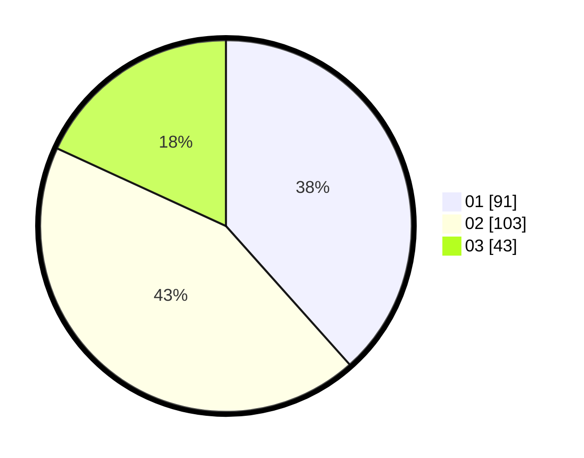

# Hasil

Hasil perolehan suara paslon dapat dilihat pada file paslon-01.txt, paslon-02.txt, dan paslon-03.txt.

Jika tidak ada, artinya data tersebut belum ada pada SIREKAP.

## Perolehan Suara

 * Paslon 01: **91**.
 * Paslon 02: **103**.
 * Paslon 03: **43**.

## Foto C Plano

https://sirekap-obj-formc.kpu.go.id/573f/pemilu/ppwp/31/75/10/10/04/3175101004022-20240215-220445--3bda3345-8c81-4120-af0f-fd3ca7d91288.jpg

https://sirekap-obj-formc.kpu.go.id/573f/pemilu/ppwp/31/75/10/10/04/3175101004022-20240215-220448--1c69cbe6-ea31-4691-b39b-656b449be294.jpg

https://sirekap-obj-formc.kpu.go.id/573f/pemilu/ppwp/31/75/10/10/04/3175101004022-20240215-220447--78f2e5b4-710c-4813-a319-b324846256de.jpg

## DATA PEMILIH TETAP

Jumlah pemilih dalam DPT: **280**.
 * L: **137**.
 * P: **143**.

## DATA PENGGUNA HAK PILIH

Jumlah pengguna hak pilih dalam DPT: **236**.
 * L: **114**.
 * P: **122**.

Jumlah pengguna hak pilih dalam DPTb: **0**.
 * L: **0**.
 * P: **0**.

Jumlah pengguna hak pilih dalam DPK: **2**.
 * L: **2**.
 * P: **0**.

Jumlah pengguna hak pilih: **238**.
 * L: **116**.
 * P: **122**.

## JUMLAH SUARA SAH DAN TIDAK SAH

JUMLAH SELURUH SUARA SAH: **237**.

JUMLAH SUARA TIDAK SAH: **1**.

JUMLAH SELURUH SUARA SAH DAN SUARA TIDAK SAH: **238**.
