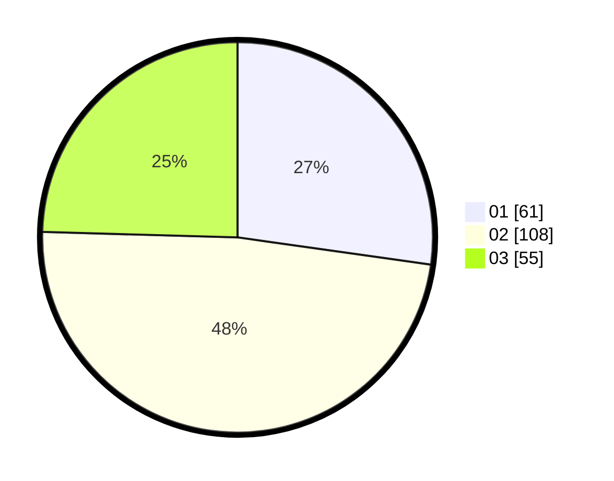

# Hasil

Hasil perolehan suara paslon dapat dilihat pada file paslon-01.txt, paslon-02.txt, dan paslon-03.txt.

Jika tidak ada, artinya data tersebut belum ada pada SIREKAP.

## Perolehan Suara

 * Paslon 01: **61**.
 * Paslon 02: **108**.
 * Paslon 03: **55**.

## Foto C Plano

https://sirekap-obj-formc.kpu.go.id/5196/pemilu/ppwp/31/75/10/10/04/3175101004023-20240216-001832--786e64cd-d2f8-4da0-b606-ae2066251b4a.jpg

https://sirekap-obj-formc.kpu.go.id/5196/pemilu/ppwp/31/75/10/10/04/3175101004023-20240216-001835--4a314a10-bad9-4f5a-98a1-231e6bd234a2.jpg

https://sirekap-obj-formc.kpu.go.id/5196/pemilu/ppwp/31/75/10/10/04/3175101004023-20240216-001834--fd744144-e433-4cb7-9acc-d8af4d3f0b73.jpg

## DATA PEMILIH TETAP

Jumlah pemilih dalam DPT: **286**.
 * L: **127**.
 * P: **159**.

## DATA PENGGUNA HAK PILIH

Jumlah pengguna hak pilih dalam DPT: **223**.
 * L: **96**.
 * P: **127**.

Jumlah pengguna hak pilih dalam DPTb: **1**.
 * L: **0**.
 * P: **1**.

Jumlah pengguna hak pilih dalam DPK: **2**.
 * L: **1**.
 * P: **1**.

Jumlah pengguna hak pilih: **226**.
 * L: **97**.
 * P: **129**.

## JUMLAH SUARA SAH DAN TIDAK SAH

JUMLAH SELURUH SUARA SAH: **224**.

JUMLAH SUARA TIDAK SAH: **2**.

JUMLAH SELURUH SUARA SAH DAN SUARA TIDAK SAH: **226**.
