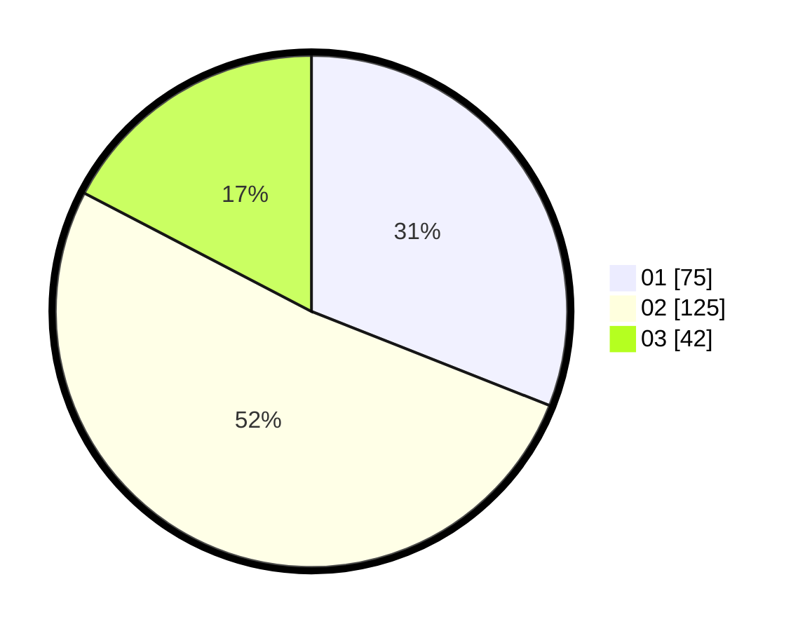

# Hasil

Hasil perolehan suara paslon dapat dilihat pada file paslon-01.txt, paslon-02.txt, dan paslon-03.txt.

Jika tidak ada, artinya data tersebut belum ada pada SIREKAP.

## Perolehan Suara

 * Paslon 01: **75**.
 * Paslon 02: **125**.
 * Paslon 03: **42**.

## Foto C Plano

https://sirekap-obj-formc.kpu.go.id/2c64/pemilu/ppwp/31/75/10/10/04/3175101004024-20240214-200229--2fb22808-f009-46f7-8d31-0b96c188f399.jpg

https://sirekap-obj-formc.kpu.go.id/2c64/pemilu/ppwp/31/75/10/10/04/3175101004024-20240214-200400--bf48e10c-fbf4-45f5-89e9-544e55e092a4.jpg

https://sirekap-obj-formc.kpu.go.id/2c64/pemilu/ppwp/31/75/10/10/04/3175101004024-20240214-200459--585bbbee-6491-4db4-80fc-4c236acd8ab1.jpg

## DATA PEMILIH TETAP

Jumlah pemilih dalam DPT: **291**.
 * L: **128**.
 * P: **163**.

## DATA PENGGUNA HAK PILIH

Jumlah pengguna hak pilih dalam DPT: **242**.
 * L: **106**.
 * P: **136**.

Jumlah pengguna hak pilih dalam DPTb: **0**.
 * L: **0**.
 * P: **0**.

Jumlah pengguna hak pilih dalam DPK: **3**.
 * L: **1**.
 * P: **2**.

Jumlah pengguna hak pilih: **245**.
 * L: **107**.
 * P: **138**.

## JUMLAH SUARA SAH DAN TIDAK SAH

JUMLAH SELURUH SUARA SAH: **242**.

JUMLAH SUARA TIDAK SAH: **3**.

JUMLAH SELURUH SUARA SAH DAN SUARA TIDAK SAH: **245**.
