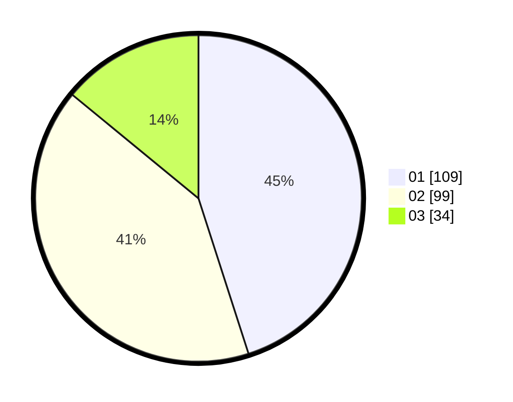

# Hasil

Hasil perolehan suara paslon dapat dilihat pada file paslon-01.txt, paslon-02.txt, dan paslon-03.txt.

Jika tidak ada, artinya data tersebut belum ada pada SIREKAP.

## Perolehan Suara

 * Paslon 01: **109**.
 * Paslon 02: **99**.
 * Paslon 03: **34**.

## Foto C Plano

https://sirekap-obj-formc.kpu.go.id/4533/pemilu/ppwp/31/75/10/10/04/3175101004028-20240216-063017--7e023fb1-f05e-41fb-81b9-f248f2271a1b.jpg

https://sirekap-obj-formc.kpu.go.id/4533/pemilu/ppwp/31/75/10/10/04/3175101004028-20240216-063021--0fab563d-336b-4544-906f-81fb11ffac43.jpg

https://sirekap-obj-formc.kpu.go.id/4533/pemilu/ppwp/31/75/10/10/04/3175101004028-20240216-063020--3163e0a1-f2dc-4051-bd60-2058590112a1.jpg

## DATA PEMILIH TETAP

Jumlah pemilih dalam DPT: **278**.
 * L: **130**.
 * P: **148**.

## DATA PENGGUNA HAK PILIH

Jumlah pengguna hak pilih dalam DPT: **241**.
 * L: **110**.
 * P: **131**.

Jumlah pengguna hak pilih dalam DPTb: **3**.
 * L: **1**.
 * P: **2**.

Jumlah pengguna hak pilih dalam DPK: **0**.
 * L: **0**.
 * P: **0**.

Jumlah pengguna hak pilih: **244**.
 * L: **111**.
 * P: **133**.

## JUMLAH SUARA SAH DAN TIDAK SAH

JUMLAH SELURUH SUARA SAH: **242**.

JUMLAH SUARA TIDAK SAH: **2**.

JUMLAH SELURUH SUARA SAH DAN SUARA TIDAK SAH: **244**.
