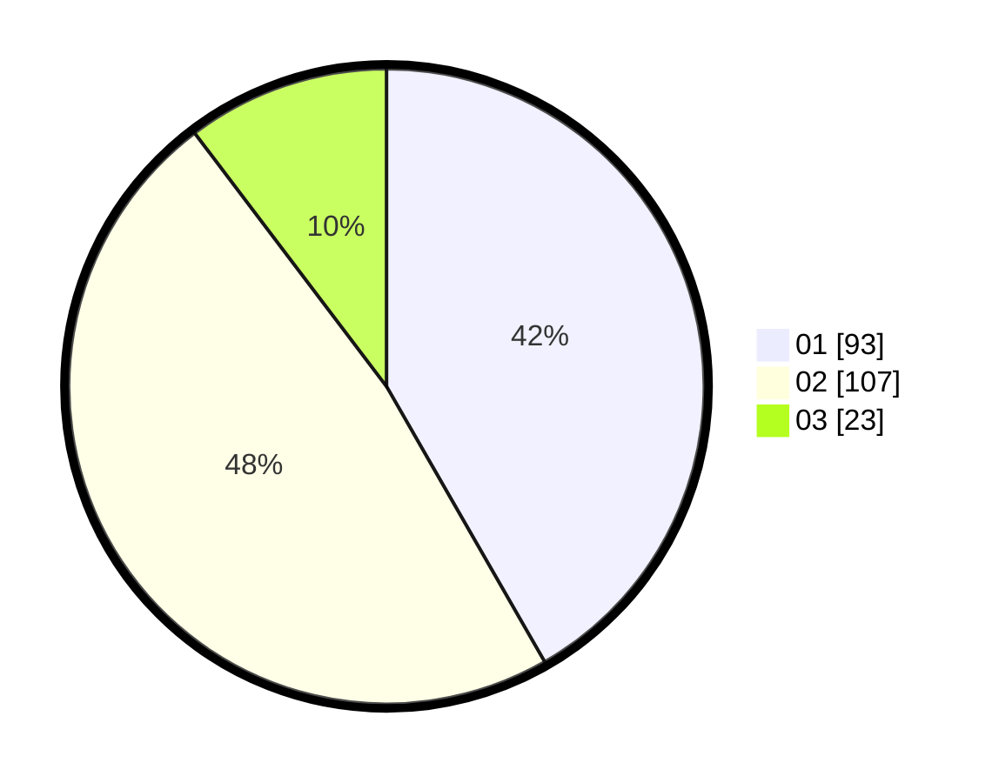

# Hasil

Hasil perolehan suara paslon dapat dilihat pada file paslon-01.txt, paslon-02.txt, dan paslon-03.txt.

Jika tidak ada, artinya data tersebut belum ada pada SIREKAP.

## Perolehan Suara

 * Paslon 01: **93**.
 * Paslon 02: **107**.
 * Paslon 03: **23**.

## Foto C Plano

https://sirekap-obj-formc.kpu.go.id/4477/pemilu/ppwp/31/75/10/10/04/3175101004030-20240215-000318--9bfd56b1-c2e9-4f98-8a72-c03399645978.jpg

https://sirekap-obj-formc.kpu.go.id/4477/pemilu/ppwp/31/75/10/10/04/3175101004030-20240216-151427--6aebb07e-16b4-4fd2-bf87-8f8dabb1fe33.jpg

https://sirekap-obj-formc.kpu.go.id/4477/pemilu/ppwp/31/75/10/10/04/3175101004030-20240216-151426--d7721456-181c-495f-a27e-660c4ad9268e.jpg

## DATA PEMILIH TETAP

Jumlah pemilih dalam DPT: **278**.
 * L: **131**.
 * P: **147**.

## DATA PENGGUNA HAK PILIH

Jumlah pengguna hak pilih dalam DPT: **218**.
 * L: **94**.
 * P: **124**.

Jumlah pengguna hak pilih dalam DPTb: **5**.
 * L: **2**.
 * P: **3**.

Jumlah pengguna hak pilih dalam DPK: **4**.
 * L: **0**.
 * P: **4**.

Jumlah pengguna hak pilih: **227**.
 * L: **96**.
 * P: **131**.

## JUMLAH SUARA SAH DAN TIDAK SAH

JUMLAH SELURUH SUARA SAH: **223**.

JUMLAH SUARA TIDAK SAH: **4**.

JUMLAH SELURUH SUARA SAH DAN SUARA TIDAK SAH: **227**.
