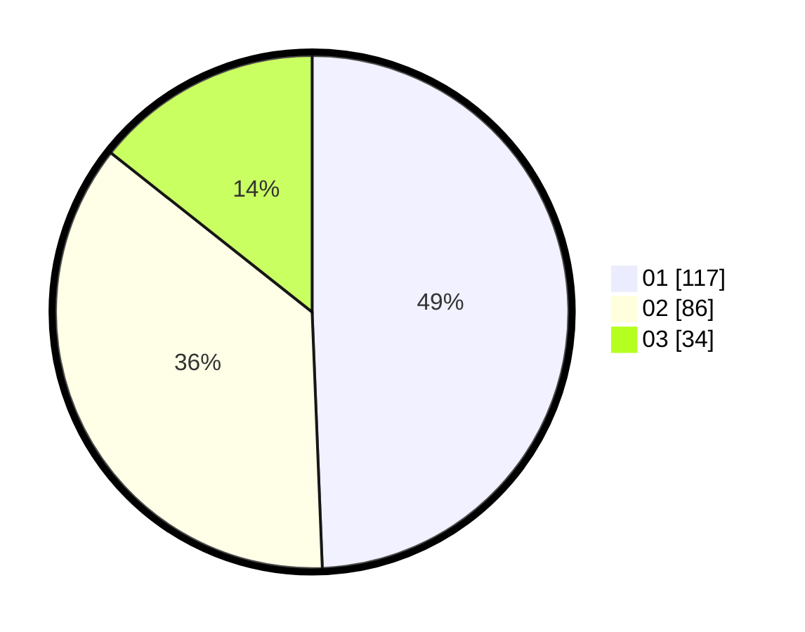

# Hasil

Hasil perolehan suara paslon dapat dilihat pada file paslon-01.txt, paslon-02.txt, dan paslon-03.txt.

Jika tidak ada, artinya data tersebut belum ada pada SIREKAP.

## Perolehan Suara

 * Paslon 01: **117**.
 * Paslon 02: **86**.
 * Paslon 03: **34**.

## Foto C Plano

https://sirekap-obj-formc.kpu.go.id/f598/pemilu/ppwp/31/75/10/10/04/3175101004031-20240215-043845--bcbf1b80-950c-4b5a-8aad-bcddeea5add4.jpg

https://sirekap-obj-formc.kpu.go.id/f598/pemilu/ppwp/31/75/10/10/04/3175101004031-20240215-043906--13208a51-35b8-4e9c-8029-41f03c9cf5a8.jpg

https://sirekap-obj-formc.kpu.go.id/f598/pemilu/ppwp/31/75/10/10/04/3175101004031-20240215-043855--cc41e02c-f7a3-44e8-8f25-0cb18b547f54.jpg

## DATA PEMILIH TETAP

Jumlah pemilih dalam DPT: **284**.
 * L: **143**.
 * P: **141**.

## DATA PENGGUNA HAK PILIH

Jumlah pengguna hak pilih dalam DPT: **236**.
 * L: **115**.
 * P: **121**.

Jumlah pengguna hak pilih dalam DPTb: **4**.
 * L: **2**.
 * P: **2**.

Jumlah pengguna hak pilih dalam DPK: **1**.
 * L: **0**.
 * P: **1**.

Jumlah pengguna hak pilih: **241**.
 * L: **117**.
 * P: **124**.

## JUMLAH SUARA SAH DAN TIDAK SAH

JUMLAH SELURUH SUARA SAH: **237**.

JUMLAH SUARA TIDAK SAH: **4**.

JUMLAH SELURUH SUARA SAH DAN SUARA TIDAK SAH: **241**.
