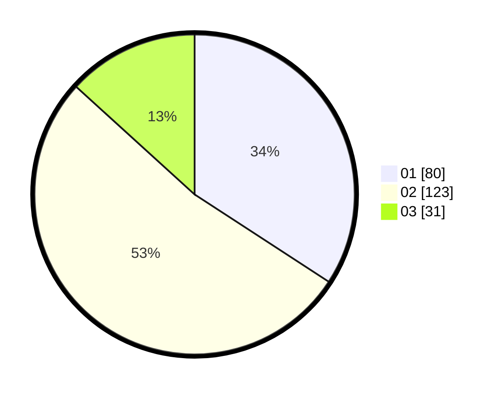

# Hasil

Hasil perolehan suara paslon dapat dilihat pada file paslon-01.txt, paslon-02.txt, dan paslon-03.txt.

Jika tidak ada, artinya data tersebut belum ada pada SIREKAP.

## Perolehan Suara

 * Paslon 01: **80**.
 * Paslon 02: **123**.
 * Paslon 03: **31**.

## Foto C Plano

https://sirekap-obj-formc.kpu.go.id/58e4/pemilu/ppwp/31/75/10/10/04/3175101004034-20240215-210525--e7a9609d-19a6-433c-a06c-5208c784982f.jpg

https://sirekap-obj-formc.kpu.go.id/58e4/pemilu/ppwp/31/75/10/10/04/3175101004034-20240215-210526--f3a88706-0e24-4785-978a-0ad201371346.jpg

https://sirekap-obj-formc.kpu.go.id/58e4/pemilu/ppwp/31/75/10/10/04/3175101004034-20240215-210526--d3488d1e-e934-49a5-a7d5-9fcc4eda702f.jpg

## DATA PEMILIH TETAP

Jumlah pemilih dalam DPT: **280**.
 * L: **147**.
 * P: **133**.

## DATA PENGGUNA HAK PILIH

Jumlah pengguna hak pilih dalam DPT: **233**.
 * L: **120**.
 * P: **113**.

Jumlah pengguna hak pilih dalam DPTb: **3**.
 * L: **1**.
 * P: **2**.

Jumlah pengguna hak pilih dalam DPK: **0**.
 * L: **0**.
 * P: **0**.

Jumlah pengguna hak pilih: **236**.
 * L: **121**.
 * P: **115**.

## JUMLAH SUARA SAH DAN TIDAK SAH

JUMLAH SELURUH SUARA SAH: **234**.

JUMLAH SUARA TIDAK SAH: **2**.

JUMLAH SELURUH SUARA SAH DAN SUARA TIDAK SAH: **236**.
