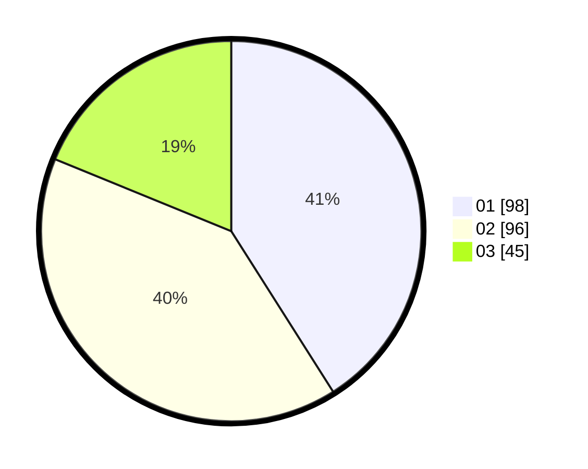

# Hasil

Hasil perolehan suara paslon dapat dilihat pada file paslon-01.txt, paslon-02.txt, dan paslon-03.txt.

Jika tidak ada, artinya data tersebut belum ada pada SIREKAP.

## Perolehan Suara

 * Paslon 01: **98**.
 * Paslon 02: **96**.
 * Paslon 03: **45**.

## Foto C Plano

https://sirekap-obj-formc.kpu.go.id/3543/pemilu/ppwp/31/75/10/10/04/3175101004035-20240214-200111--54714d21-9346-4237-9c3c-27b56ee3d2c2.jpg

https://sirekap-obj-formc.kpu.go.id/3543/pemilu/ppwp/31/75/10/10/04/3175101004035-20240214-200202--6dc51a3c-7010-4fd9-9cfd-402575cae0fe.jpg

https://sirekap-obj-formc.kpu.go.id/3543/pemilu/ppwp/31/75/10/10/04/3175101004035-20240214-202228--68d944ab-665b-4b15-b4a3-9b3175413d1c.jpg

## DATA PEMILIH TETAP

Jumlah pemilih dalam DPT: **277**.
 * L: **144**.
 * P: **133**.

## DATA PENGGUNA HAK PILIH

Jumlah pengguna hak pilih dalam DPT: **244**.
 * L: **121**.
 * P: **123**.

Jumlah pengguna hak pilih dalam DPTb: **0**.
 * L: **0**.
 * P: **0**.

Jumlah pengguna hak pilih dalam DPK: **0**.
 * L: **0**.
 * P: **0**.

Jumlah pengguna hak pilih: **244**.
 * L: **121**.
 * P: **123**.

## JUMLAH SUARA SAH DAN TIDAK SAH

JUMLAH SELURUH SUARA SAH: **239**.

JUMLAH SUARA TIDAK SAH: **5**.

JUMLAH SELURUH SUARA SAH DAN SUARA TIDAK SAH: **244**.
