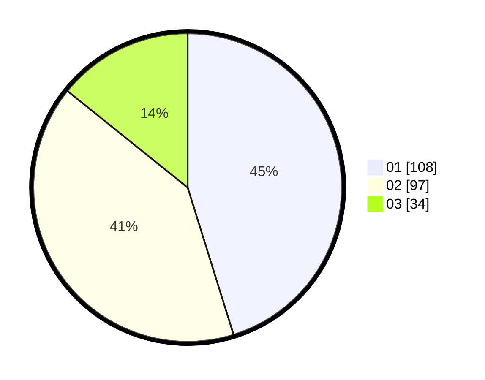

# Hasil

Hasil perolehan suara paslon dapat dilihat pada file paslon-01.txt, paslon-02.txt, dan paslon-03.txt.

Jika tidak ada, artinya data tersebut belum ada pada SIREKAP.

## Perolehan Suara

 * Paslon 01: **108**.
 * Paslon 02: **97**.
 * Paslon 03: **34**.

## Foto C Plano

https://sirekap-obj-formc.kpu.go.id/45bb/pemilu/ppwp/31/75/10/10/04/3175101004040-20240216-154835--cdf56f9c-1209-4b35-a17c-f8f4e3879fe4.jpg

https://sirekap-obj-formc.kpu.go.id/45bb/pemilu/ppwp/31/75/10/10/04/3175101004040-20240216-154836--e1feba04-1e27-4ef9-bd65-05fe6f0f477e.jpg

https://sirekap-obj-formc.kpu.go.id/45bb/pemilu/ppwp/31/75/10/10/04/3175101004040-20240216-154835--fcd00bf2-b973-4a9c-b702-8ac87bd2b5b9.jpg

## DATA PEMILIH TETAP

Jumlah pemilih dalam DPT: **282**.
 * L: **143**.
 * P: **139**.

## DATA PENGGUNA HAK PILIH

Jumlah pengguna hak pilih dalam DPT: **238**.
 * L: **122**.
 * P: **116**.

Jumlah pengguna hak pilih dalam DPTb: **1**.
 * L: **0**.
 * P: **1**.

Jumlah pengguna hak pilih dalam DPK: **1**.
 * L: **1**.
 * P: **0**.

Jumlah pengguna hak pilih: **240**.
 * L: **123**.
 * P: **117**.

## JUMLAH SUARA SAH DAN TIDAK SAH

JUMLAH SELURUH SUARA SAH: **239**.

JUMLAH SUARA TIDAK SAH: **1**.

JUMLAH SELURUH SUARA SAH DAN SUARA TIDAK SAH: **240**.
