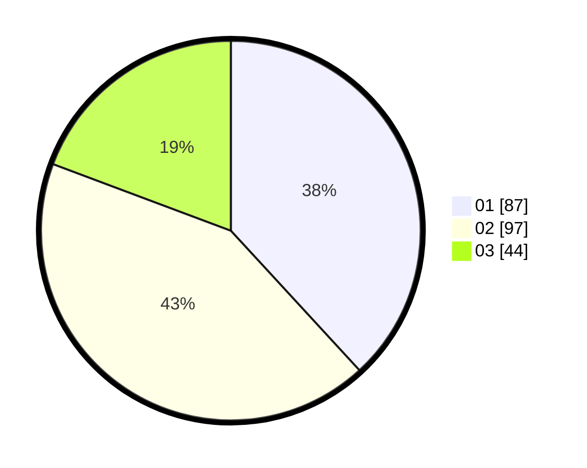

# Hasil

Hasil perolehan suara paslon dapat dilihat pada file paslon-01.txt, paslon-02.txt, dan paslon-03.txt.

Jika tidak ada, artinya data tersebut belum ada pada SIREKAP.

## Perolehan Suara

 * Paslon 01: **87**.
 * Paslon 02: **97**.
 * Paslon 03: **44**.

## Foto C Plano

https://sirekap-obj-formc.kpu.go.id/1ef4/pemilu/ppwp/31/75/10/10/04/3175101004041-20240216-075304--93e4e496-a852-4ba6-b072-262a0d23b06f.jpg

https://sirekap-obj-formc.kpu.go.id/1ef4/pemilu/ppwp/31/75/10/10/04/3175101004041-20240216-075309--23eb2f03-f9e2-4a85-aac4-3ffd76866f74.jpg

https://sirekap-obj-formc.kpu.go.id/1ef4/pemilu/ppwp/31/75/10/10/04/3175101004041-20240216-074054--6b11d517-ece0-4e0c-b218-1303b6ed91b8.jpg

## DATA PEMILIH TETAP

Jumlah pemilih dalam DPT: **273**.
 * L: **131**.
 * P: **142**.

## DATA PENGGUNA HAK PILIH

Jumlah pengguna hak pilih dalam DPT: **225**.
 * L: **102**.
 * P: **123**.

Jumlah pengguna hak pilih dalam DPTb: **4**.
 * L: **2**.
 * P: **2**.

Jumlah pengguna hak pilih dalam DPK: **1**.
 * L: **1**.
 * P: **0**.

Jumlah pengguna hak pilih: **230**.
 * L: **105**.
 * P: **125**.

## JUMLAH SUARA SAH DAN TIDAK SAH

JUMLAH SELURUH SUARA SAH: **228**.

JUMLAH SUARA TIDAK SAH: **2**.

JUMLAH SELURUH SUARA SAH DAN SUARA TIDAK SAH: **230**.
