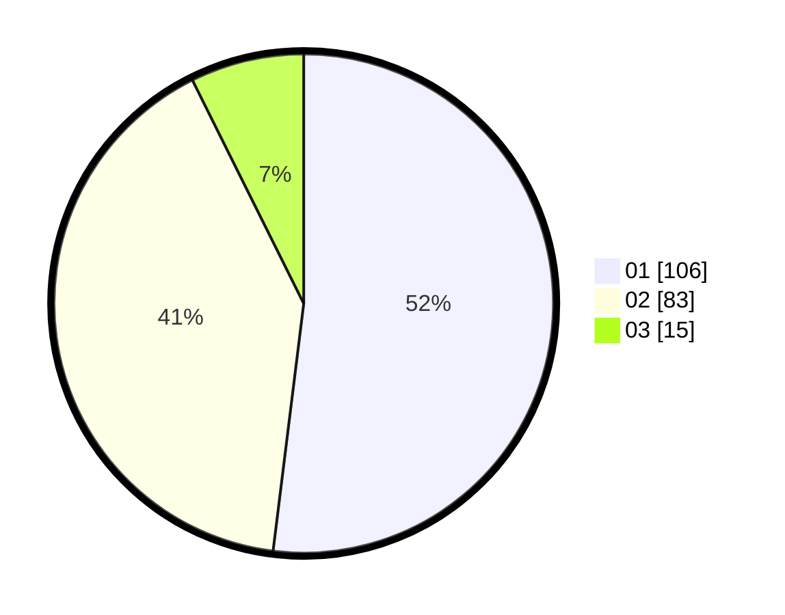

# Hasil

Hasil perolehan suara paslon dapat dilihat pada file paslon-01.txt, paslon-02.txt, dan paslon-03.txt.

Jika tidak ada, artinya data tersebut belum ada pada SIREKAP.

## Perolehan Suara

 * Paslon 01: **106**.
 * Paslon 02: **83**.
 * Paslon 03: **15**.

## Foto C Plano

https://sirekap-obj-formc.kpu.go.id/af4d/pemilu/ppwp/31/75/10/10/04/3175101004043-20240215-050743--257f252b-9853-404a-adeb-a0602533b9ea.jpg

https://sirekap-obj-formc.kpu.go.id/af4d/pemilu/ppwp/31/75/10/10/04/3175101004043-20240215-050828--fc234f66-3d80-41da-9b6d-96e28691c481.jpg

https://sirekap-obj-formc.kpu.go.id/af4d/pemilu/ppwp/31/75/10/10/04/3175101004043-20240215-050838--5070a340-06c8-45b0-a5c5-95b468b54331.jpg

## DATA PEMILIH TETAP

Jumlah pemilih dalam DPT: **267**.
 * L: **128**.
 * P: **139**.

## DATA PENGGUNA HAK PILIH

Jumlah pengguna hak pilih dalam DPT: **205**.
 * L: **94**.
 * P: **111**.

Jumlah pengguna hak pilih dalam DPTb: **0**.
 * L: **0**.
 * P: **0**.

Jumlah pengguna hak pilih dalam DPK: **0**.
 * L: **0**.
 * P: **0**.

Jumlah pengguna hak pilih: **205**.
 * L: **94**.
 * P: **111**.

## JUMLAH SUARA SAH DAN TIDAK SAH

JUMLAH SELURUH SUARA SAH: **204**.

JUMLAH SUARA TIDAK SAH: **1**.

JUMLAH SELURUH SUARA SAH DAN SUARA TIDAK SAH: **205**.
