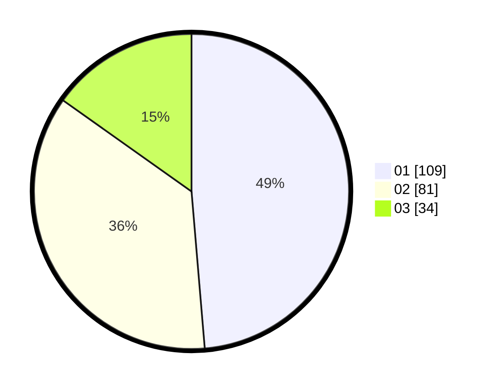

# Hasil

Hasil perolehan suara paslon dapat dilihat pada file paslon-01.txt, paslon-02.txt, dan paslon-03.txt.

Jika tidak ada, artinya data tersebut belum ada pada SIREKAP.

## Perolehan Suara

 * Paslon 01: **109**.
 * Paslon 02: **81**.
 * Paslon 03: **34**.

## Foto C Plano

https://sirekap-obj-formc.kpu.go.id/e2ec/pemilu/ppwp/31/75/10/10/04/3175101004052-20240214-210600--8395fcf9-26d8-4b57-b6a0-2511841a8308.jpg

https://sirekap-obj-formc.kpu.go.id/e2ec/pemilu/ppwp/31/75/10/10/04/3175101004052-20240214-210743--16cc90f7-95dd-49d4-ad7a-c802c8c95734.jpg

https://sirekap-obj-formc.kpu.go.id/e2ec/pemilu/ppwp/31/75/10/10/04/3175101004052-20240214-210843--d719c600-1cd9-4d72-8146-43a1826d0c10.jpg
