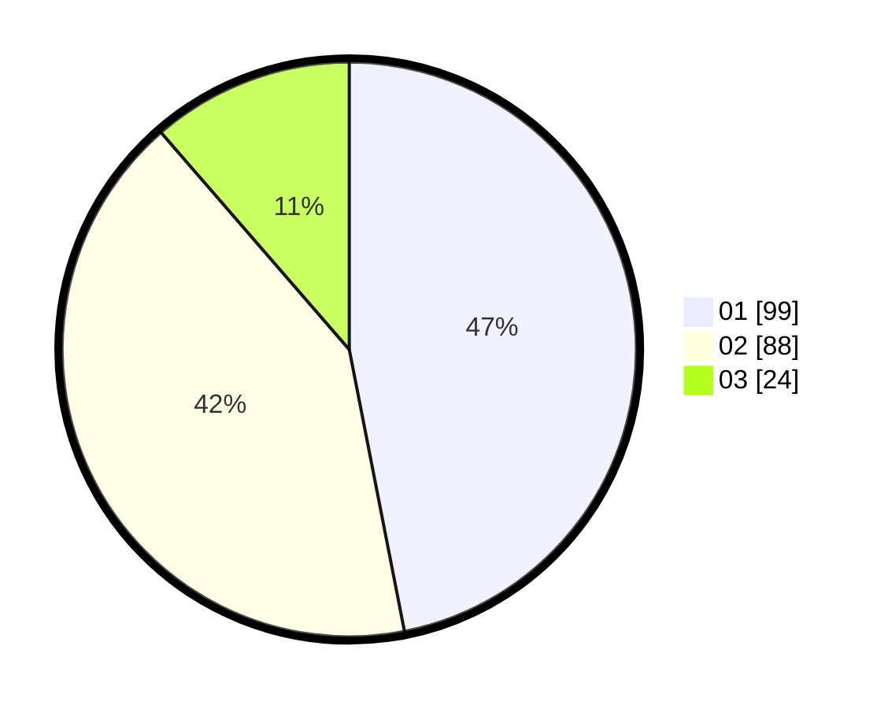

# Hasil

Hasil perolehan suara paslon dapat dilihat pada file paslon-01.txt, paslon-02.txt, dan paslon-03.txt.

Jika tidak ada, artinya data tersebut belum ada pada SIREKAP.

## Perolehan Suara

 * Paslon 01: **99**.
 * Paslon 02: **88**.
 * Paslon 03: **24**.

## Foto C Plano

https://sirekap-obj-formc.kpu.go.id/9ef0/pemilu/ppwp/31/75/10/10/04/3175101004055-20240216-064830--7ca333e5-3da9-422f-b911-fb40bc823a73.jpg

https://sirekap-obj-formc.kpu.go.id/9ef0/pemilu/ppwp/31/75/10/10/04/3175101004055-20240214-155302--06ca0f8a-de65-4e9d-a1e0-eb5f87308bb2.jpg

https://sirekap-obj-formc.kpu.go.id/9ef0/pemilu/ppwp/31/75/10/10/04/3175101004055-20240216-064831--90c5888d-f7aa-4dce-aa45-eb86c4ecf83b.jpg

## DATA PEMILIH TETAP

Jumlah pemilih dalam DPT: **268**.
 * L: **123**.
 * P: **145**.

## DATA PENGGUNA HAK PILIH

Jumlah pengguna hak pilih dalam DPT: **208**.
 * L: **92**.
 * P: **116**.

Jumlah pengguna hak pilih dalam DPTb: **2**.
 * L: **2**.
 * P: **0**.

Jumlah pengguna hak pilih dalam DPK: **6**.
 * L: **2**.
 * P: **4**.

Jumlah pengguna hak pilih: **216**.
 * L: **96**.
 * P: **120**.

## JUMLAH SUARA SAH DAN TIDAK SAH

JUMLAH SELURUH SUARA SAH: **211**.

JUMLAH SUARA TIDAK SAH: **5**.

JUMLAH SELURUH SUARA SAH DAN SUARA TIDAK SAH: **216**.
