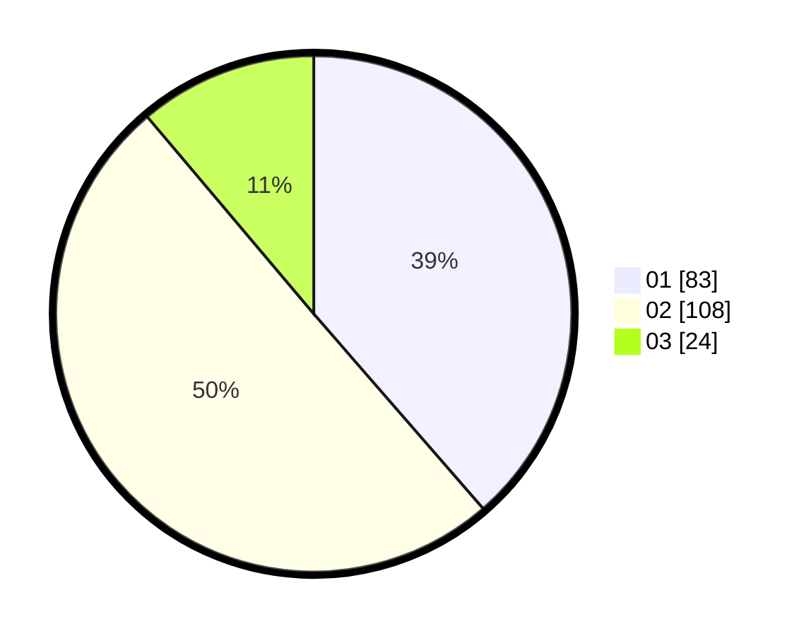

# Hasil

Hasil perolehan suara paslon dapat dilihat pada file paslon-01.txt, paslon-02.txt, dan paslon-03.txt.

Jika tidak ada, artinya data tersebut belum ada pada SIREKAP.

## Perolehan Suara

 * Paslon 01: **83**.
 * Paslon 02: **108**.
 * Paslon 03: **24**.

## Foto C Plano

https://sirekap-obj-formc.kpu.go.id/e6f4/pemilu/ppwp/31/75/10/10/04/3175101004060-20240214-201829--f053f1dc-bfa1-4740-9f9d-9265ee028aac.jpg

https://sirekap-obj-formc.kpu.go.id/e6f4/pemilu/ppwp/31/75/10/10/04/3175101004060-20240214-155035--0835b15c-7a68-469d-8745-ff483916e858.jpg

https://sirekap-obj-formc.kpu.go.id/e6f4/pemilu/ppwp/31/75/10/10/04/3175101004060-20240214-201724--fa99f62a-1291-42c7-929d-01df2cb7a5fb.jpg

## DATA PEMILIH TETAP

Jumlah pemilih dalam DPT: **261**.
 * L: **139**.
 * P: **122**.

## DATA PENGGUNA HAK PILIH

Jumlah pengguna hak pilih dalam DPT: **224**.
 * L: **116**.
 * P: **108**.

Jumlah pengguna hak pilih dalam DPTb: **2**.
 * L: **1**.
 * P: **1**.

Jumlah pengguna hak pilih dalam DPK: **1**.
 * L: **1**.
 * P: **0**.

Jumlah pengguna hak pilih: **227**.
 * L: **118**.
 * P: **109**.

## JUMLAH SUARA SAH DAN TIDAK SAH

JUMLAH SELURUH SUARA SAH: **215**.

JUMLAH SUARA TIDAK SAH: **12**.

JUMLAH SELURUH SUARA SAH DAN SUARA TIDAK SAH: **227**.
