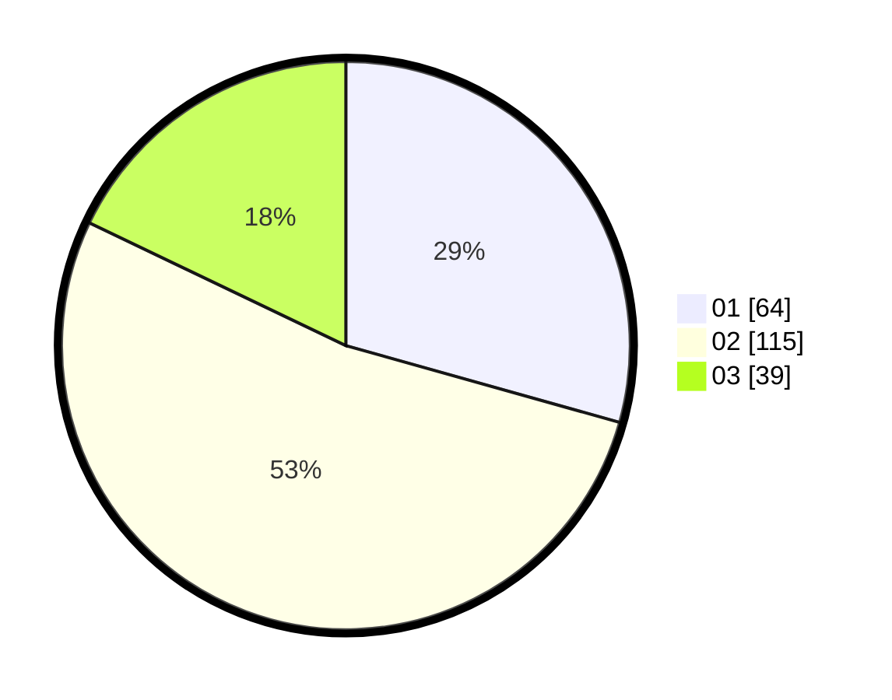

# Hasil

Hasil perolehan suara paslon dapat dilihat pada file paslon-01.txt, paslon-02.txt, dan paslon-03.txt.

Jika tidak ada, artinya data tersebut belum ada pada SIREKAP.

## Perolehan Suara

 * Paslon 01: **64**.
 * Paslon 02: **115**.
 * Paslon 03: **39**.

## Foto C Plano

https://sirekap-obj-formc.kpu.go.id/37b2/pemilu/ppwp/31/75/10/10/04/3175101004065-20240215-215142--f5eac874-4fe6-4477-9b1c-3b056b3e3d0a.jpg

https://sirekap-obj-formc.kpu.go.id/37b2/pemilu/ppwp/31/75/10/10/04/3175101004065-20240215-215146--6cd1cac9-0e2a-415b-ab5e-d804f837320f.jpg

https://sirekap-obj-formc.kpu.go.id/37b2/pemilu/ppwp/31/75/10/10/04/3175101004065-20240215-215144--cb18343a-c3c6-4a92-b85d-c9a2a6df1bc1.jpg

## DATA PEMILIH TETAP

Jumlah pemilih dalam DPT: **253**.
 * L: **123**.
 * P: **130**.

## DATA PENGGUNA HAK PILIH

Jumlah pengguna hak pilih dalam DPT: **217**.
 * L: **100**.
 * P: **117**.

Jumlah pengguna hak pilih dalam DPTb: **0**.
 * L: **0**.
 * P: **0**.

Jumlah pengguna hak pilih dalam DPK: **4**.
 * L: **1**.
 * P: **3**.

Jumlah pengguna hak pilih: **221**.
 * L: **101**.
 * P: **120**.

## JUMLAH SUARA SAH DAN TIDAK SAH

JUMLAH SELURUH SUARA SAH: **218**.

JUMLAH SUARA TIDAK SAH: **3**.

JUMLAH SELURUH SUARA SAH DAN SUARA TIDAK SAH: **221**.
