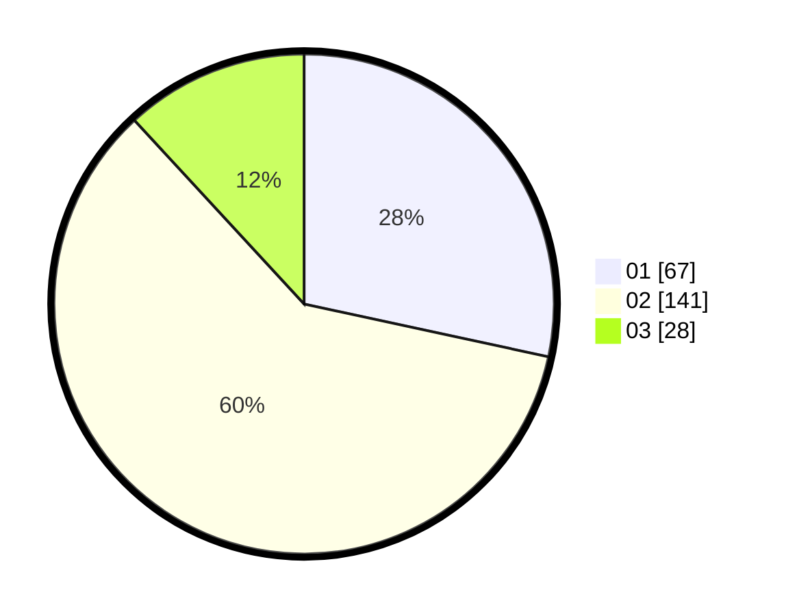

# Hasil

Hasil perolehan suara paslon dapat dilihat pada file paslon-01.txt, paslon-02.txt, dan paslon-03.txt.

Jika tidak ada, artinya data tersebut belum ada pada SIREKAP.

## Perolehan Suara

 * Paslon 01: **67**.
 * Paslon 02: **141**.
 * Paslon 03: **28**.

## Foto C Plano

https://sirekap-obj-formc.kpu.go.id/438e/pemilu/ppwp/31/75/10/10/04/3175101004067-20240214-190839--235ad332-8344-4298-a61d-55da53b032d9.jpg

https://sirekap-obj-formc.kpu.go.id/438e/pemilu/ppwp/31/75/10/10/04/3175101004067-20240214-191554--3bb2ad6c-f0d4-4c2e-b1d5-ce54f5f7d2c3.jpg

https://sirekap-obj-formc.kpu.go.id/438e/pemilu/ppwp/31/75/10/10/04/3175101004067-20240214-191154--9cd99aea-9bf1-4f60-8235-9db992fc94db.jpg

## DATA PEMILIH TETAP

Jumlah pemilih dalam DPT: **281**.
 * L: **132**.
 * P: **149**.

## DATA PENGGUNA HAK PILIH

Jumlah pengguna hak pilih dalam DPT: **234**.
 * L: **103**.
 * P: **131**.

Jumlah pengguna hak pilih dalam DPTb: **1**.
 * L: **1**.
 * P: **0**.

Jumlah pengguna hak pilih dalam DPK: **3**.
 * L: **2**.
 * P: **1**.

Jumlah pengguna hak pilih: **238**.
 * L: **106**.
 * P: **132**.

## JUMLAH SUARA SAH DAN TIDAK SAH

JUMLAH SELURUH SUARA SAH: **236**.

JUMLAH SUARA TIDAK SAH: **2**.

JUMLAH SELURUH SUARA SAH DAN SUARA TIDAK SAH: **238**.
