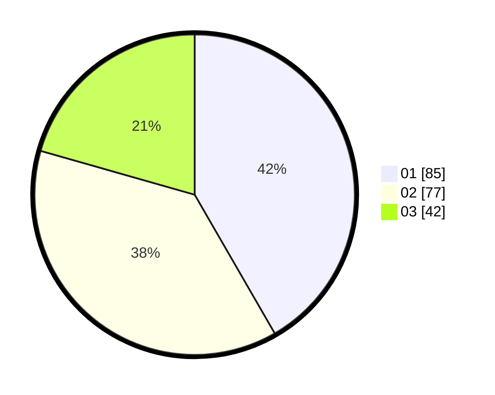

# Hasil

Hasil perolehan suara paslon dapat dilihat pada file paslon-01.txt, paslon-02.txt, dan paslon-03.txt.

Jika tidak ada, artinya data tersebut belum ada pada SIREKAP.

## Perolehan Suara

 * Paslon 01: **85**.
 * Paslon 02: **77**.
 * Paslon 03: **42**.

## Foto C Plano

https://sirekap-obj-formc.kpu.go.id/6faf/pemilu/ppwp/31/75/10/10/04/3175101004069-20240214-184745--44d73184-d685-404b-bb0e-ddfd0091af29.jpg

https://sirekap-obj-formc.kpu.go.id/6faf/pemilu/ppwp/31/75/10/10/04/3175101004069-20240214-184750--a960e0f6-2f2b-4321-99f6-e0effbf3b147.jpg

https://sirekap-obj-formc.kpu.go.id/6faf/pemilu/ppwp/31/75/10/10/04/3175101004069-20240214-184751--10f08aba-0344-43d8-8eeb-9fc5d31ca0d9.jpg

## DATA PEMILIH TETAP

Jumlah pemilih dalam DPT: **282**.
 * L: **145**.
 * P: **137**.

## DATA PENGGUNA HAK PILIH

Jumlah pengguna hak pilih dalam DPT: **208**.
 * L: **104**.
 * P: **104**.

Jumlah pengguna hak pilih dalam DPTb: **2**.
 * L: **1**.
 * P: **1**.

Jumlah pengguna hak pilih dalam DPK: **0**.
 * L: **0**.
 * P: **0**.

Jumlah pengguna hak pilih: **210**.
 * L: **105**.
 * P: **105**.

## JUMLAH SUARA SAH DAN TIDAK SAH

JUMLAH SELURUH SUARA SAH: **204**.

JUMLAH SUARA TIDAK SAH: **6**.

JUMLAH SELURUH SUARA SAH DAN SUARA TIDAK SAH: **210**.
