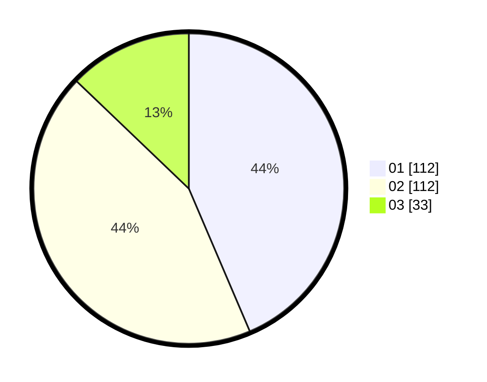

# Hasil

Hasil perolehan suara paslon dapat dilihat pada file paslon-01.txt, paslon-02.txt, dan paslon-03.txt.

Jika tidak ada, artinya data tersebut belum ada pada SIREKAP.

## Perolehan Suara

 * Paslon 01: **112**.
 * Paslon 02: **112**.
 * Paslon 03: **33**.

## Foto C Plano

https://sirekap-obj-formc.kpu.go.id/b9ed/pemilu/ppwp/31/75/10/10/04/3175101004071-20240214-155350--dd3b6544-f81c-4729-8874-10d54a05a630.jpg

https://sirekap-obj-formc.kpu.go.id/b9ed/pemilu/ppwp/31/75/10/10/04/3175101004071-20240214-155430--164829db-4de6-49ac-ae63-868bfbc01088.jpg

https://sirekap-obj-formc.kpu.go.id/b9ed/pemilu/ppwp/31/75/10/10/04/3175101004071-20240214-155527--7083c03c-7f86-40f4-a0a4-c8a91f39feda.jpg

## DATA PEMILIH TETAP

Jumlah pemilih dalam DPT: **286**.
 * L: **146**.
 * P: **140**.

## DATA PENGGUNA HAK PILIH

Jumlah pengguna hak pilih dalam DPT: **254**.
 * L: **127**.
 * P: **127**.

Jumlah pengguna hak pilih dalam DPTb: **7**.
 * L: **5**.
 * P: **2**.

Jumlah pengguna hak pilih dalam DPK: **1**.
 * L: **0**.
 * P: **1**.

Jumlah pengguna hak pilih: **262**.
 * L: **132**.
 * P: **130**.

## JUMLAH SUARA SAH DAN TIDAK SAH

JUMLAH SELURUH SUARA SAH: **257**.

JUMLAH SUARA TIDAK SAH: **3**.

JUMLAH SELURUH SUARA SAH DAN SUARA TIDAK SAH: **260**.
