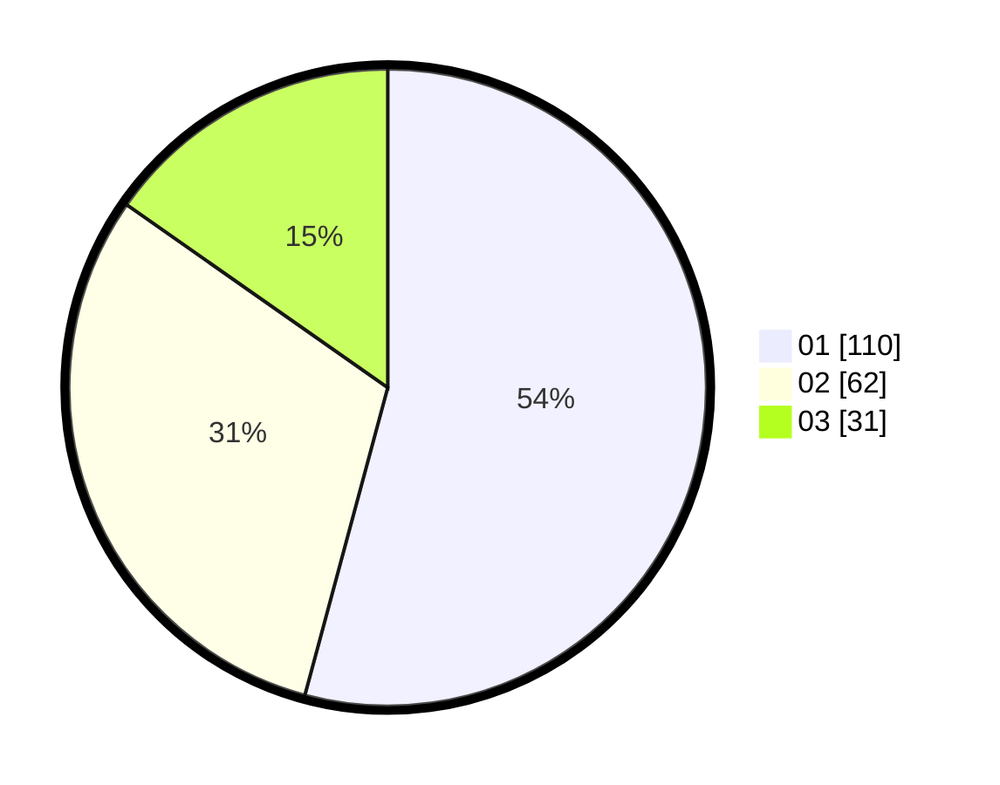

# Hasil

Hasil perolehan suara paslon dapat dilihat pada file paslon-01.txt, paslon-02.txt, dan paslon-03.txt.

Jika tidak ada, artinya data tersebut belum ada pada SIREKAP.

## Perolehan Suara

 * Paslon 01: **110**.
 * Paslon 02: **62**.
 * Paslon 03: **31**.

## Foto C Plano

https://sirekap-obj-formc.kpu.go.id/26f6/pemilu/ppwp/31/75/10/10/05/3175101005007-20240214-195814--4b6448e9-e332-4030-8690-5426ce842ffb.jpg

https://sirekap-obj-formc.kpu.go.id/26f6/pemilu/ppwp/31/75/10/10/05/3175101005007-20240214-195824--b24aca41-87ba-4b2d-a31d-4c6b8d7d6c14.jpg
