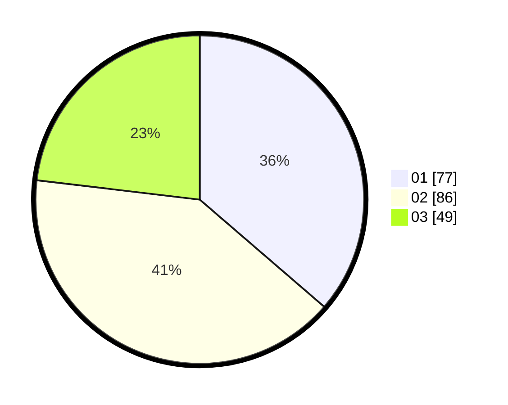

# Hasil

Hasil perolehan suara paslon dapat dilihat pada file paslon-01.txt, paslon-02.txt, dan paslon-03.txt.

Jika tidak ada, artinya data tersebut belum ada pada SIREKAP.

## Perolehan Suara

 * Paslon 01: **77**.
 * Paslon 02: **86**.
 * Paslon 03: **49**.

## Foto C Plano

https://sirekap-obj-formc.kpu.go.id/b608/pemilu/ppwp/31/75/10/10/05/3175101005030-20240216-034657--3fb6ffbe-e96f-4122-8819-2b28fd2c602f.jpg

https://sirekap-obj-formc.kpu.go.id/b608/pemilu/ppwp/31/75/10/10/05/3175101005030-20240216-034701--f43fc970-6cd9-438f-8558-54775dd56a68.jpg

https://sirekap-obj-formc.kpu.go.id/b608/pemilu/ppwp/31/75/10/10/05/3175101005030-20240216-034700--7d42f836-d8b9-42bf-a963-8e65b86490b7.jpg

## DATA PEMILIH TETAP

Jumlah pemilih dalam DPT: **267**.
 * L: **136**.
 * P: **131**.

## DATA PENGGUNA HAK PILIH

Jumlah pengguna hak pilih dalam DPT: **204**.
 * L: **99**.
 * P: **105**.

Jumlah pengguna hak pilih dalam DPTb: **10**.
 * L: **7**.
 * P: **3**.

Jumlah pengguna hak pilih dalam DPK: **1**.
 * L: **0**.
 * P: **1**.

Jumlah pengguna hak pilih: **215**.
 * L: **106**.
 * P: **109**.

## JUMLAH SUARA SAH DAN TIDAK SAH

JUMLAH SELURUH SUARA SAH: **212**.

JUMLAH SUARA TIDAK SAH: **3**.

JUMLAH SELURUH SUARA SAH DAN SUARA TIDAK SAH: **215**.
