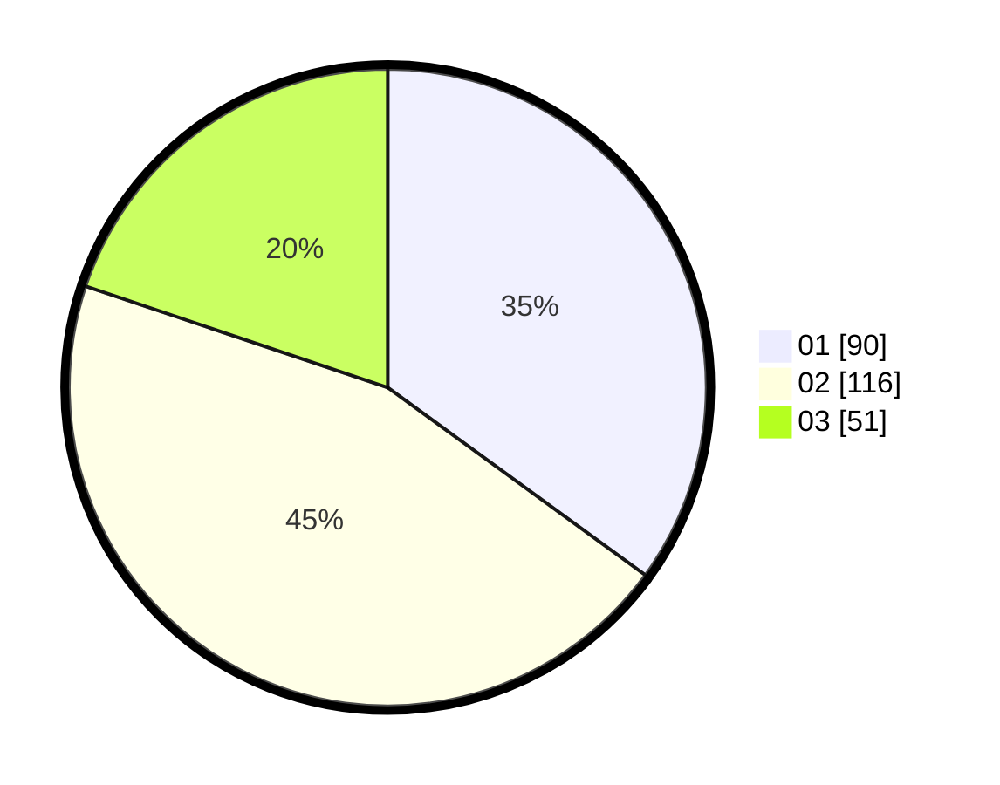

# Hasil

Hasil perolehan suara paslon dapat dilihat pada file paslon-01.txt, paslon-02.txt, dan paslon-03.txt.

Jika tidak ada, artinya data tersebut belum ada pada SIREKAP.

## Perolehan Suara

 * Paslon 01: **90**.
 * Paslon 02: **116**.
 * Paslon 03: **51**.

## Foto C Plano

https://sirekap-obj-formc.kpu.go.id/eaeb/pemilu/ppwp/31/75/10/10/05/3175101005033-20240214-232752--596fcb75-b3c1-4200-bdbf-0dc39c83437d.jpg

https://sirekap-obj-formc.kpu.go.id/eaeb/pemilu/ppwp/31/75/10/10/05/3175101005033-20240214-232908--330bc3f9-734a-4497-8297-52ee7c838599.jpg

https://sirekap-obj-formc.kpu.go.id/eaeb/pemilu/ppwp/31/75/10/10/05/3175101005033-20240214-233043--41e025a3-e3c6-455f-93ce-5c187c6532ab.jpg
