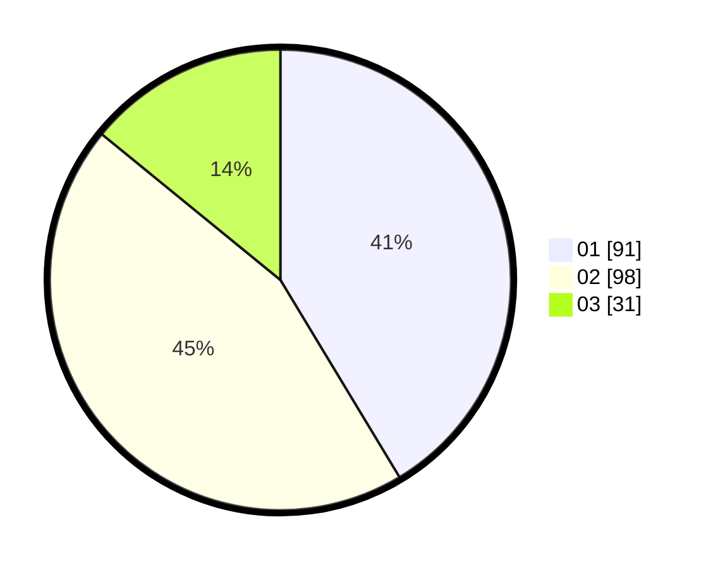

# Hasil

Hasil perolehan suara paslon dapat dilihat pada file paslon-01.txt, paslon-02.txt, dan paslon-03.txt.

Jika tidak ada, artinya data tersebut belum ada pada SIREKAP.

## Perolehan Suara

 * Paslon 01: **91**.
 * Paslon 02: **98**.
 * Paslon 03: **31**.

## Foto C Plano

https://sirekap-obj-formc.kpu.go.id/5902/pemilu/ppwp/31/75/10/10/05/3175101005039-20240214-230841--70fc3543-ca06-4a82-bdc6-2379bb923920.jpg

https://sirekap-obj-formc.kpu.go.id/5902/pemilu/ppwp/31/75/10/10/05/3175101005039-20240214-231005--f6c5afcc-d90c-4a5d-ac88-61ec10d803b6.jpg

https://sirekap-obj-formc.kpu.go.id/5902/pemilu/ppwp/31/75/10/10/05/3175101005039-20240214-231100--1bb14bb0-e1a1-4719-8bb9-1c0fc078eb8d.jpg
