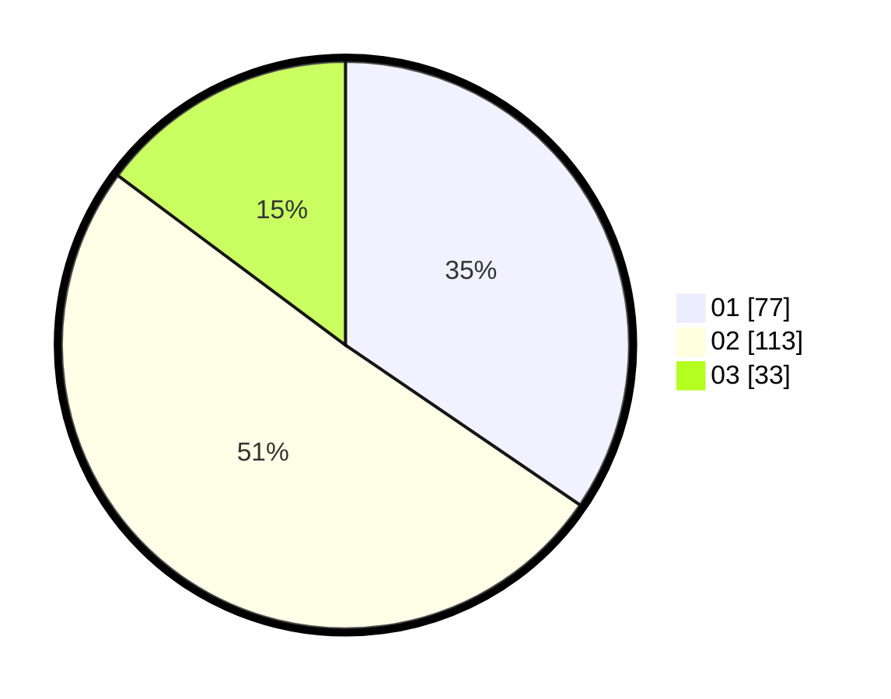

# Hasil

Hasil perolehan suara paslon dapat dilihat pada file paslon-01.txt, paslon-02.txt, dan paslon-03.txt.

Jika tidak ada, artinya data tersebut belum ada pada SIREKAP.

## Perolehan Suara

 * Paslon 01: **77**.
 * Paslon 02: **113**.
 * Paslon 03: **33**.

## Foto C Plano

https://sirekap-obj-formc.kpu.go.id/ba5d/pemilu/ppwp/31/75/10/10/05/3175101005051-20240214-224059--82470822-eb37-4266-b3a9-c83907c3b60d.jpg

https://sirekap-obj-formc.kpu.go.id/ba5d/pemilu/ppwp/31/75/10/10/05/3175101005051-20240215-155933--051cc5b3-9fb7-4bce-b219-38a26551b745.jpg

https://sirekap-obj-formc.kpu.go.id/ba5d/pemilu/ppwp/31/75/10/10/05/3175101005051-20240214-224417--11e628c8-92f2-458e-9977-d489d4890c8f.jpg

## DATA PEMILIH TETAP

Jumlah pemilih dalam DPT: **264**.
 * L: **125**.
 * P: **139**.

## DATA PENGGUNA HAK PILIH

Jumlah pengguna hak pilih dalam DPT: **224**.
 * L: **104**.
 * P: **120**.

Jumlah pengguna hak pilih dalam DPTb: **1**.
 * L: **0**.
 * P: **1**.

Jumlah pengguna hak pilih dalam DPK: **2**.
 * L: **0**.
 * P: **2**.

Jumlah pengguna hak pilih: **227**.
 * L: **104**.
 * P: **123**.

## JUMLAH SUARA SAH DAN TIDAK SAH

JUMLAH SELURUH SUARA SAH: **223**.

JUMLAH SUARA TIDAK SAH: **4**.

JUMLAH SELURUH SUARA SAH DAN SUARA TIDAK SAH: **227**.
