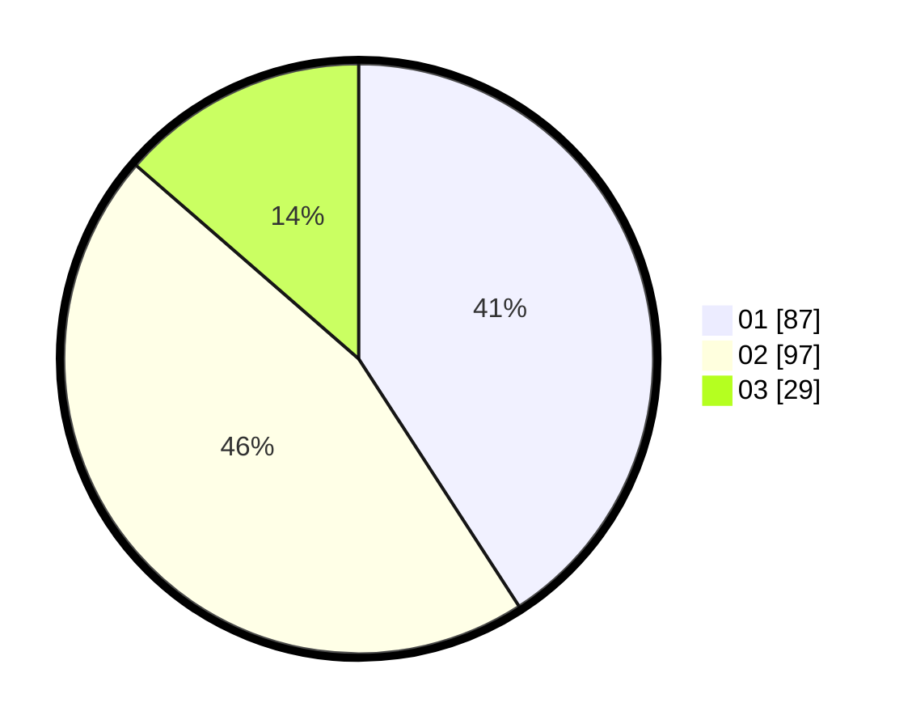

# Hasil

Hasil perolehan suara paslon dapat dilihat pada file paslon-01.txt, paslon-02.txt, dan paslon-03.txt.

Jika tidak ada, artinya data tersebut belum ada pada SIREKAP.

## Perolehan Suara

 * Paslon 01: **87**.
 * Paslon 02: **97**.
 * Paslon 03: **29**.

## Foto C Plano

https://sirekap-obj-formc.kpu.go.id/4c33/pemilu/ppwp/31/75/10/10/05/3175101005054-20240216-015529--6b535a2f-739a-414e-8fef-b7585d30fc9e.jpg

https://sirekap-obj-formc.kpu.go.id/4c33/pemilu/ppwp/31/75/10/10/05/3175101005054-20240216-013705--03204777-706a-4fc7-ba05-dd275f5d7042.jpg

https://sirekap-obj-formc.kpu.go.id/4c33/pemilu/ppwp/31/75/10/10/05/3175101005054-20240216-015530--4ce91d71-7316-4f96-bcec-3ed2bbbe4e2d.jpg

## DATA PEMILIH TETAP

Jumlah pemilih dalam DPT: **273**.
 * L: **132**.
 * P: **141**.

## DATA PENGGUNA HAK PILIH

Jumlah pengguna hak pilih dalam DPT: **214**.
 * L: **96**.
 * P: **118**.

Jumlah pengguna hak pilih dalam DPTb: **0**.
 * L: **0**.
 * P: **0**.

Jumlah pengguna hak pilih dalam DPK: **0**.
 * L: **0**.
 * P: **0**.

Jumlah pengguna hak pilih: **214**.
 * L: **96**.
 * P: **118**.

## JUMLAH SUARA SAH DAN TIDAK SAH

JUMLAH SELURUH SUARA SAH: **213**.

JUMLAH SUARA TIDAK SAH: **2**.

JUMLAH SELURUH SUARA SAH DAN SUARA TIDAK SAH: **215**.
