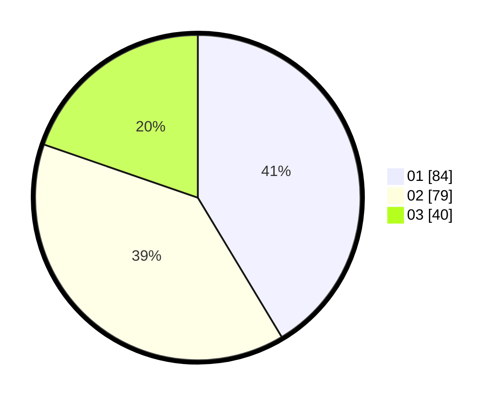

# Hasil

Hasil perolehan suara paslon dapat dilihat pada file paslon-01.txt, paslon-02.txt, dan paslon-03.txt.

Jika tidak ada, artinya data tersebut belum ada pada SIREKAP.

## Perolehan Suara

 * Paslon 01: **84**.
 * Paslon 02: **79**.
 * Paslon 03: **40**.

## Foto C Plano

https://sirekap-obj-formc.kpu.go.id/c06e/pemilu/ppwp/31/75/10/10/05/3175101005055-20240214-194739--7bdae54c-41f3-48eb-8b7e-84b4f829d38d.jpg

https://sirekap-obj-formc.kpu.go.id/c06e/pemilu/ppwp/31/75/10/10/05/3175101005055-20240214-194754--a2fce028-157e-49e7-9604-3714d904c203.jpg

https://sirekap-obj-formc.kpu.go.id/c06e/pemilu/ppwp/31/75/10/10/05/3175101005055-20240214-194811--a268d47c-50bd-4225-9aaa-733e3b86765d.jpg

## DATA PEMILIH TETAP

Jumlah pemilih dalam DPT: **252**.
 * L: **112**.
 * P: **140**.

## DATA PENGGUNA HAK PILIH

Jumlah pengguna hak pilih dalam DPT: **198**.
 * L: **83**.
 * P: **115**.

Jumlah pengguna hak pilih dalam DPTb: **4**.
 * L: **1**.
 * P: **3**.

Jumlah pengguna hak pilih dalam DPK: **2**.
 * L: **1**.
 * P: **1**.

Jumlah pengguna hak pilih: **204**.
 * L: **85**.
 * P: **119**.

## JUMLAH SUARA SAH DAN TIDAK SAH

JUMLAH SELURUH SUARA SAH: **203**.

JUMLAH SUARA TIDAK SAH: **1**.

JUMLAH SELURUH SUARA SAH DAN SUARA TIDAK SAH: **204**.
